## 开发愿景

经多次迭代，最终架构设计为三层：

1. 布局层，允许多种布局生成来源，但是最终都要规约为统一的布局描述格式文件。
2. 模型层，允许根据标准布局描述文件生成模型，并且进行6个维度的旋转、线性变换以及材质更新等等功能，
3. 业务信息层，从此开始，根据id对各种信息进行整理并于实际的模型进行绑定，但是无论是从后台的数据存储还是前台的操作逻辑，该层和前两层保持隔离，前两层为无业务信息的数学形式数据。

## 整体工作流

LayoutCraft最初是服务于平面图到3D城市模型的流程：它整合了参数化布局生成、轮廓提取、自由绘制和3D模型预览等功能，最终输出标准格式的JSON文件和通用模型文件。

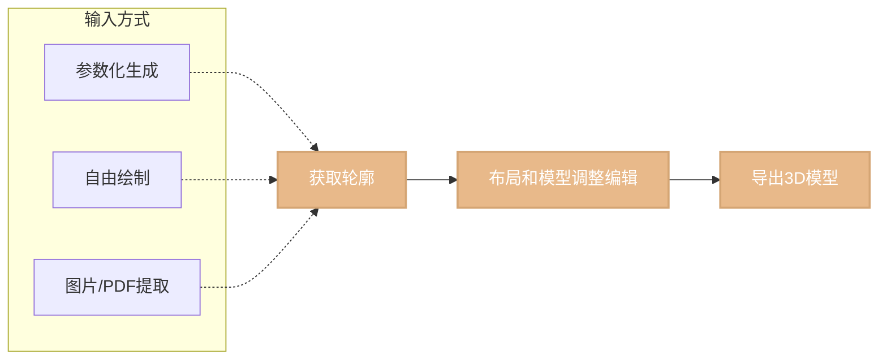

## 分页介绍

### 首页

首页布局主要负责展示应用的基本工作流以及一些简单的产品更新和使用文档，关键按钮是进入工作台和进入自由绘制模式。

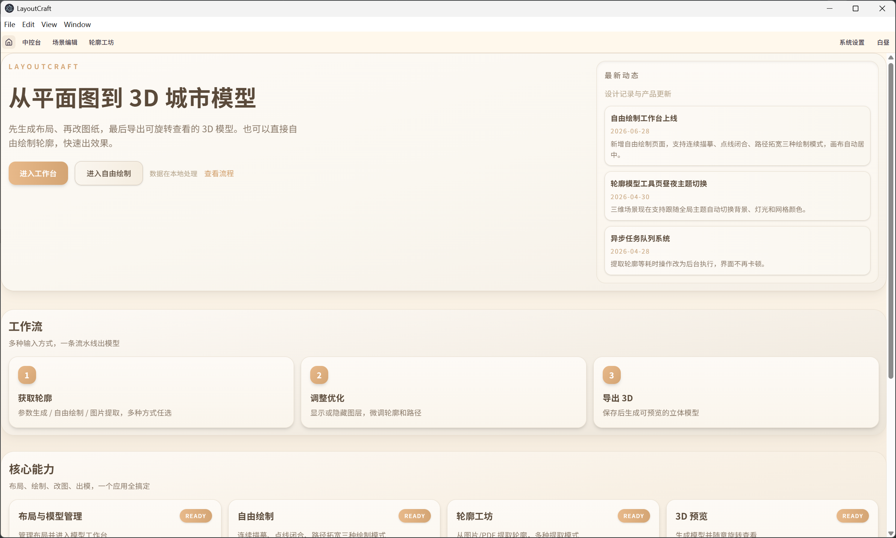

### 构建新布局页面

从首页点击进入工作台按钮之后，进入了中控台，其中为布局和模型列表。当想要添加新布局的时候，点击左上角的添加布局的按钮，其会提供三种方式以供使用：

1. 程序化布局生成
2. 基于PDF和图片的轮廓提取，兼顾一定的自由绘制
3. 完全的自由绘制

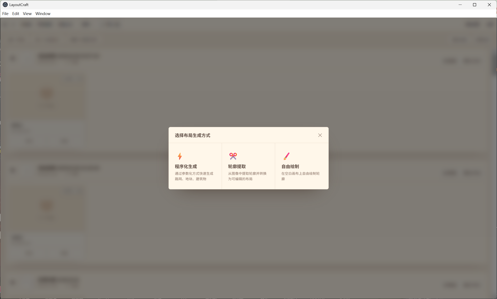

#### 轮廓提取方式

##### 基本操作步骤

进入后，首先载入文件（图片或者PDF），会渲染在左侧，然后坐标系也会根据载入的底图调整

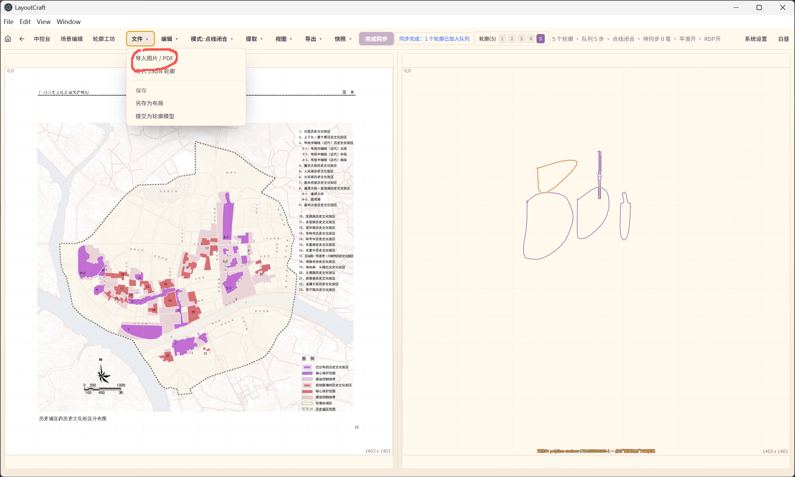

选择绘制模式，有四种模式：

1. 种子点泛洪提取，右键左图需要提取的色块，然后点击同步按钮，右侧会生成提取结果轮廓，支持多个种子点批量提取。
2. 连线描摹绘制，左键长按连续绘制，停止后，点击同步按钮，在左侧加载轮廓结果，会自动首尾闭合。
3. 点线绘制，左键单击确定起点，然后移动光标，出现线段跟随，再次左键单击，确定第二个锚点，依次往复，然后右键结束绘制，点击同步按钮，轮廓结果渲染在左侧
4. 路径拓宽，左键长按拖动即可，点击同步后，右侧自动根据连线拓宽为长条形形状。

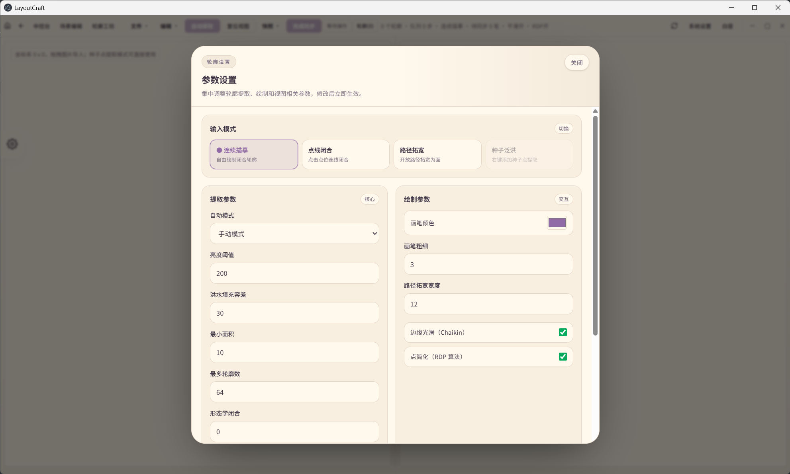

##### 保存布局

绘制完成后点击保存即可，保存为覆盖性；另存为会重新构建为一个新布局。

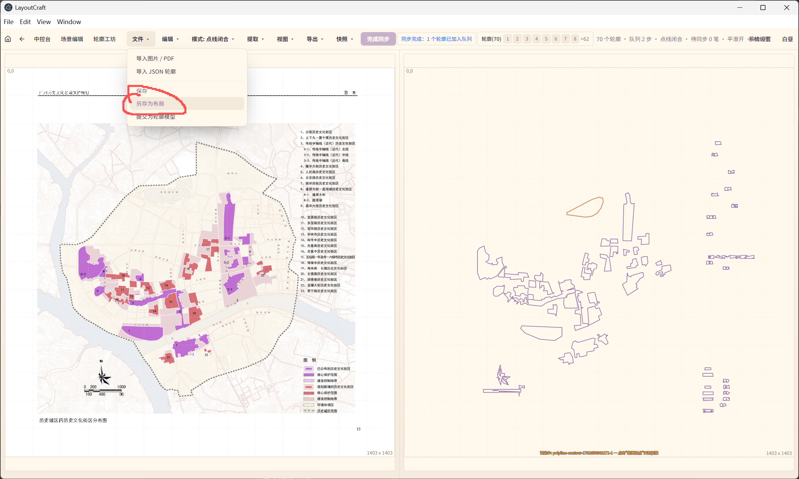

##### 参数调控

参数面板通过左侧齿轮点击弹出进行编辑，参数包括：

1. 泛洪容差，影响提取效果。
2. 轮廓过滤最小面积
3. 边缘是否平滑
4. 点简化是否开机
5. 轮廓提取的自动还是手动模式，自动模式会尝试批量整图提取，适合底图整洁无杂物的时候使用。
6. 其它参数不作介绍。

#### 自由绘画模式

画布居中不需要导入底图，只保留轮廓提取除了种子点提取的其它三种绘制模式，绘制完成后，点击右上角保存布局即可。

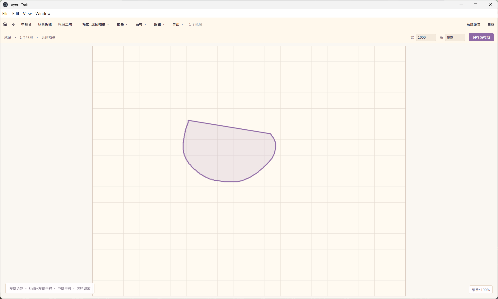

#### 参数化布局生成

左侧是参数面板，可以选择导入JSON文件配置，也可以导出已经配置好的参数内容，配置好后可以在右上方点击生成按钮，会生成布局。

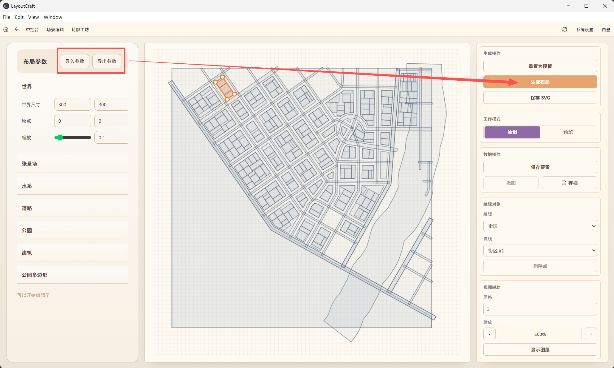

可以在当前页面直接进行布局编辑，布局由于存在分类集合，需要在右侧选中轮廓集合并选中特定轮廓，工作区进行高亮才可以进行编辑操作，允许点击线段增加点、删除点、拖拽点操作。

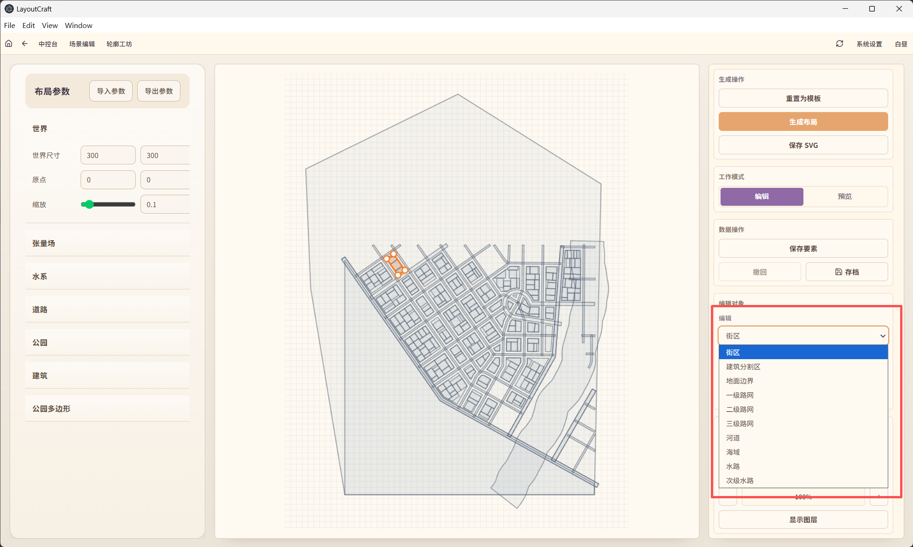

属于程序化生成的特殊控件还有层级轮廓可选的显示和隐藏，通过右侧进行控制：

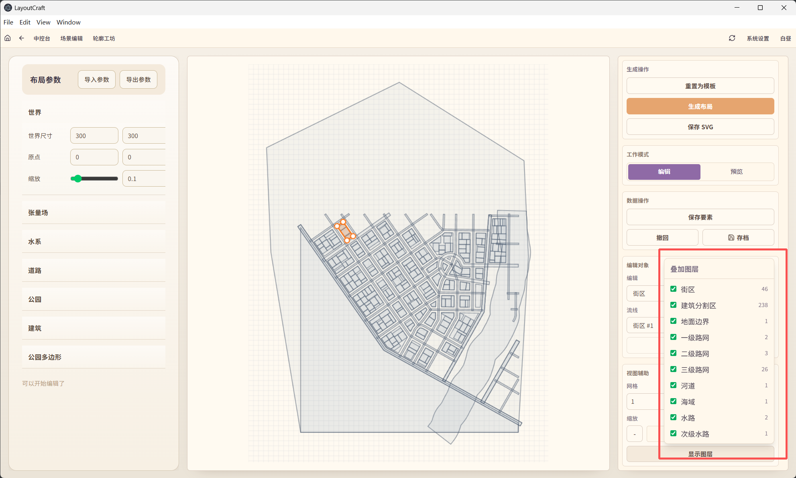

生成模型结果

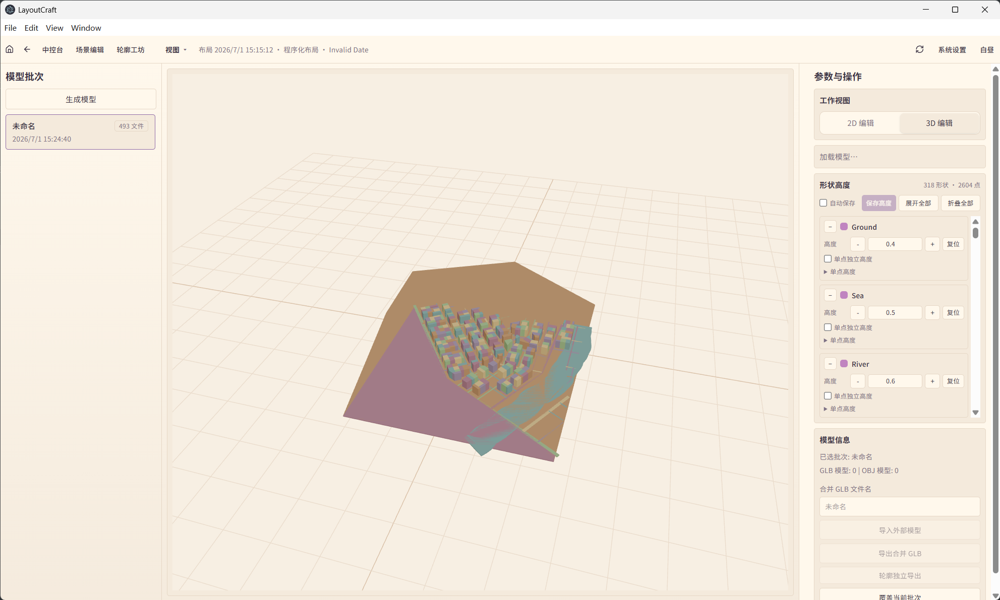

### 模型工作台页

#### 2D编辑

返回中控台之后，点击生成模型按钮即可生成模型。

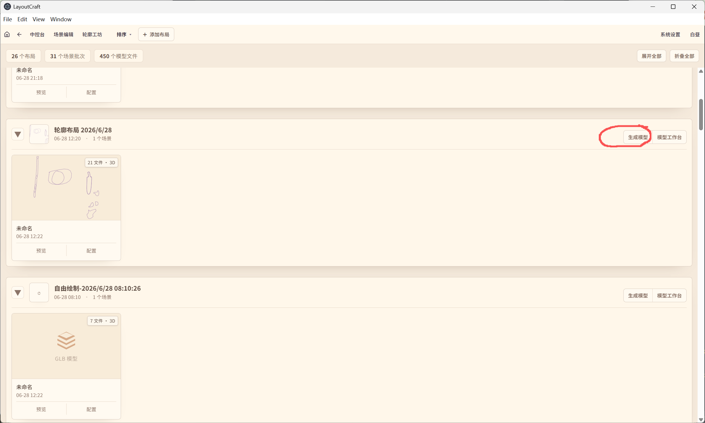

生成模型后进入模型工作台

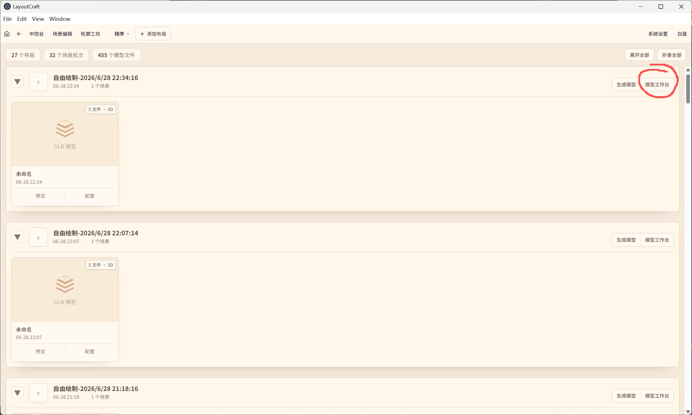

进入后出现2D编辑，基本操作包括：

1. 拖拽点位置
2. 增加点，通过点击线段，即可相应位置增加节点
3. 撤销操作

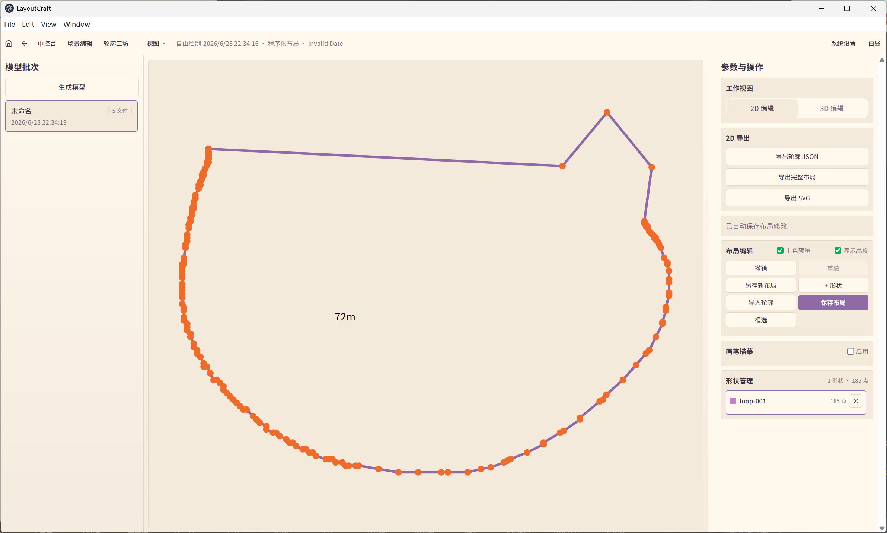

启用画笔模式，可以进行自由绘制，然后实时同步到当前二维编辑画布之中。

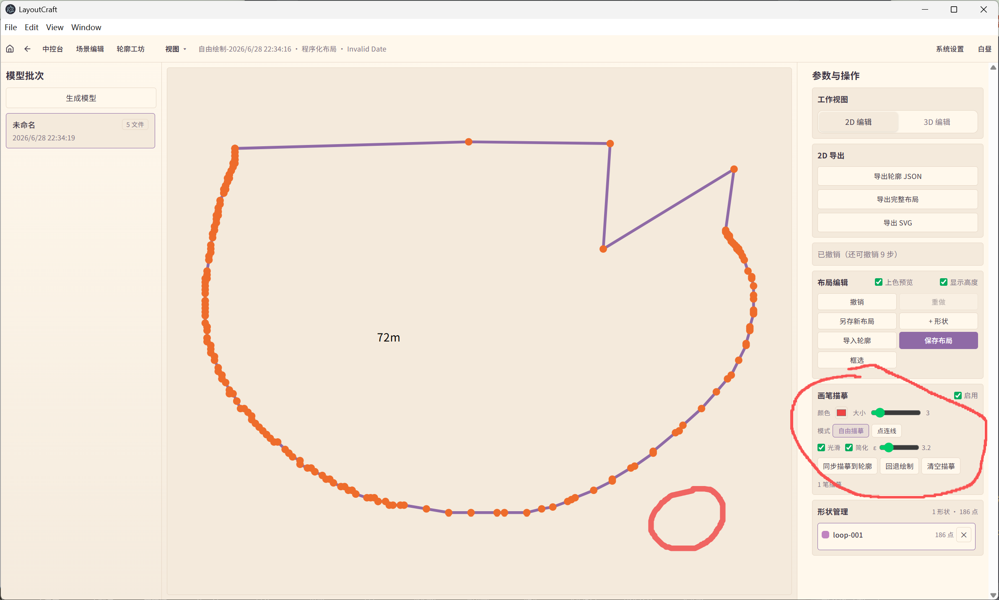

各种操作完成后，可以选择：

1. 导出布局svg和json
2. 覆盖保存和另存为新布局

#### 3D编辑

3D 场景模式根据二维布局实时渲染同步，其所属布局调整后，场景模型也会改变，其默认高度策略和模型面积有关，策略拟定为面积和模型高度负相关。

右侧支持对模型的单点和多点统一的高度调整并实时渲染预览，并支持持久化保存。

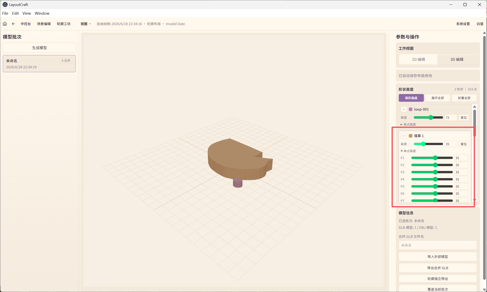

选中模型之后支持以下功能：

1. 对模型的材质进行一定程度的修改和保存
2. 调整单个模型的位置偏移和旋转角度，6向变换，旋转中心默认是全局坐标，也可选模型中心为局部坐标参考系。
3. 局部参考系和全局参考系的可视化渲染，并且局部参考系可以自主调整。
4. 缩放、剪切等线性变换。

最终对模型的编辑可以导出（合并为一个模型导出或者模型分别导出整合为压缩包形式）或者覆盖性保存。

## 已知的待完善功能

1. 轮廓提取部分的快照功能，非核心功能。
2. 多种模式绘制作为轮廓输入时候的队列批次管理，与之对应的有回退、上一步等功能。
3. 模型高度策略没有统一应用。
4. 信息绑定模块属于待重构状态，现在几乎不可用。
5. 自由绘制部分在放大调整尺寸的时候，轮廓隐藏丢失问题；还有程序化生成部分在边界动态缩放的时候存在闪烁问题。

各个页面功能的操作逻辑需要统一一下，基本的逻辑都是顶部全局工具栏，然后左右两侧放置参数面板、控制面板、列表面板等功能，居中空间是工作区。

由于轮廓提取需要提供轮廓左右两侧的参照对比，目前是工作区需要两块很大的地方，舍弃了左右两侧边栏的，关键设置通过悬浮按钮点击弹出中央控制面板来调控，这样能把空间留给工作区。

但是又有plan B：直接把底图和轮廓结果重合在一起，就像临摹字体一样，这样就不用左右两个大工作区，然后各种控制以及参数面板就可以都仿照vscode、blender等的布局，即参数控件面板在左右两侧。

这样重叠绘制有一个问题，就是绘制的轮廓太多*（底部内容较多）的时候，会导致界面混乱，轮廓结果和底图混在一起，会影响持续的提取工作。