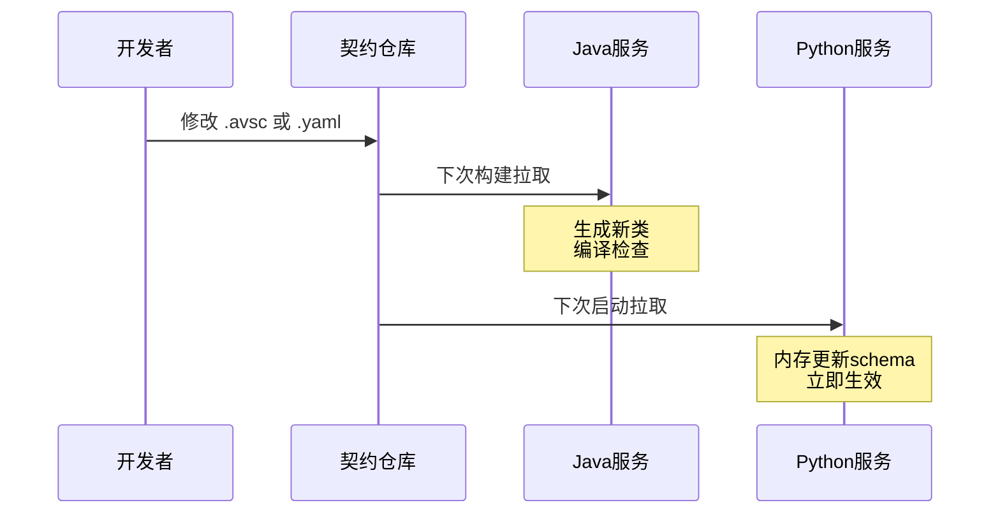

今日状态依旧不佳，还是重于算法题，简历还是优先整一份，其次再等通知再搞ppt。

待办任务，依旧是隔离java的环境问题，把用户验证和实际模型服务分成两个模块比较好，这样后续移动也方便点，直接一整个文件夹就拖走了，也能隔离。

kafka就可能提升到基础设施层级，不要和业务代码混在一块了。

具体实现细节：

1. 新建两个子模块。
2. 分别管理模型生成和用户管理模块。
3. 分别启动服务。

## 待解决问题

web端访问内容结构依旧提供的是原始ip地址加端口后而非域名，导致其会访问本地的9000接口，但是这个web是通过frp端口转发渲染出来的，因此其访问并不是实际的服务宿主机上的对象服务器而是web渲染机的对象服务器，导致无法正确下载内容。


### 办法

使用nginx代理服务器，将所有的服务挂在nginx之下，这样内容服务请求可以直接和web服务公用一个ip地址和端口，并在内部转发到实际的地址进行响应返回。

### 具体操作

1. 部署docker中的nginx代理服务器
2. 修改frp，开放一个nginx本地端口进行服务挂载
3. 修改web中的内容服务器请求地址，将请求发送到公网固定端口，但是目前使用vite server代理即可访问java后端，不需要配置nginx代理了。
4. 主要是配置访问对象服务器和web服务器共用同一个端口
5. 只需要把java返回的地址给到公网地址对应的公开的frp端口即可。
6. 但是貌似没有必要，直接开放两个端口即可，这样就不需要配置nginx了。
7. 但是我想兼顾本地直接测试打开也支持外部访问的时候直接实现web正常获取内容。
8. 因此还是正常通过nginx代理内容服务器，这样也便于我拆分java部分的用户和模型服务模块。
9. MinIO服务器使用参数透传即可，暂时web对应的vite代理不用修改，直接将端口8080对应到nginx本地容器即可，无需占用多余公网流量,当然也可以改为公网ip。实际上通过公网获取的只有web和MinIO服务器内容


## 契约开发

java-python之前使用kafka，使用arsv进行契约，控制接口对象同步，避免一点改动两头修改接口结构体的麻烦。

web-java使用openapi，作用类似。

## 契约生成时间

|服务|推荐方式|理由|
|---|---|---|
|**Java模型服务**|✅ **生成时**|Java必须强类型，IDE支持|
|**Python算法服务**|✅ **运行时动态**|Python动态特性，契约变更无需重启|
|**前端Web**|✅ **生成时**|TypeScript类型安全，开发体验好|


## 最终完整方案：混合契约驱动开发架构

根据我们讨论的所有要点，这是为你量身定制的最终方案。

ps 契约文件从GitHub仓库拉取到构建目录中，不污染源码。

py不生成对象，其它java和ts都生成。

### 一、整体架构概览


```
┌─────────────────────────────────────────────────────────────┐
│                    契约仓库 (GitHub)                          │
│  ┌──────────────┐  ┌──────────────┐  ┌──────────────┐      │
│  │ Avro契约      │  │ OpenAPI契约   │  │ README       │      │
│  │ ModelTask.avsc│  │ model-api.yaml│  │ 版本说明      │      │
│  │ ModelResult.avsc │ user-api.yaml│  │              │      │
│  └──────────────┘  └──────────────┘  └──────────────┘      │
└─────────────────────────────────────────────────────────────┘
                              │
            ┌─────────────────┼─────────────────┐
            ▼                 ▼                 ▼
┌─────────────────────┐ ┌─────────────────────┐ ┌─────────────────────┐
│  Java模型服务        │ │  Python算法服务      │ │  前端Web            │
│  (生成时)           │ │  (运行时动态)        │ │  (生成时)           │
├─────────────────────┤ ├─────────────────────┤ ├─────────────────────┤
│ • Maven构建时       │ │ • 启动时拉取Schema   │ │ • npm构建时         │
│ • 直接生成Java类    │ │ • 内存解析Avro       │ │ • 生成TypeScript    │
│ • 强类型安全        │ │ • 无需重新部署       │ │ • 类型安全API       │
│ • IDE完美支持       │ │ • 字典式访问         │ │ • React/Vue集成     │
└─────────────────────┘ └─────────────────────┘ └─────────────────────┘
```

### 二、项目仓库结构（完全分离）

```
GitHub组织: ai-platform
├── contracts                     # 契约仓库（唯一共享）
├── java-model-service            # Java团队独立
├── java-user-service             # Java团队独立  
├── python-algorithm              # Python团队独立
└── web-frontend                  # 前端团队独立
```

### 三、详细配置方案

#### 1. 契约仓库配置

```
contracts/
├── README.md
├── version.txt                    # 当前版本 v1.2.3
├── avro/
│   ├── ModelTaskEvent.avsc        # Java→Python任务契约
│   └── ModelResultEvent.avsc      # Python→Java结果契约
└── openapi/
    ├── model-api.yaml             # 模型服务REST接口
    └── user-api.yaml              # 用户服务REST接口
```

**ModelTaskEvent.avsc**:
```json
{
  "name": "ModelTaskEvent",
  "type": "record",
  "namespace": "com.aiplatform.contracts.avro",
  "fields": [
    {"name": "taskId", "type": "string"},
    {"name": "userId", "type": "long"},
    {"name": "modelType", "type": {"type": "enum", "name": "ModelType", "symbols": ["IMAGE", "TEXT", "AUDIO"]}},
    {"name": "inputData", "type": "string"},
    {"name": "parameters", "type": ["null", {"type": "map", "values": "string"}], "default": null},
    {"name": "priority", "type": "int", "default": 0},
    {"name": "createTime", "type": "long"}
  ]
}
```

**model-api.yaml** (OpenAPI):
```yaml
openapi: 3.0.0
info:
  title: 模型服务API
  version: 1.0.0
paths:
  /api/tasks:
    post:
      summary: 创建模型任务
      requestBody:
        required: true
        content:
          application/json:
            schema:
              $ref: '#/components/schemas/CreateTaskRequest'
      responses:
        200:
          description: 成功
          content:
            application/json:
              schema:
                $ref: '#/components/schemas/TaskResponse'
components:
  schemas:
    CreateTaskRequest:
      type: object
      required: [modelType, inputData]
      properties:
        modelType:
          type: string
          enum: [IMAGE, TEXT, AUDIO]
        inputData:
          type: string
        priority:
          type: integer
          default: 0
    TaskResponse:
      type: object
      properties:
        taskId:
          type: string
        status:
          type: string
```

#### 2. Java模型服务（生成时）

**pom.xml** (关键配置):
```xml
<project>
    <modelVersion>4.0.0</modelVersion>
    <artifactId>java-model-service</artifactId>
    
    <properties>
        <github.token>${env.GITHUB_TOKEN}</github.token>
        <contracts.version>main</contracts.version>
    </properties>
    
    <build>
        <plugins>
            <!-- Avro：直接从GitHub URL生成Java类 -->
            <plugin>
                <groupId>org.apache.avro</groupId>
                <artifactId>avro-maven-plugin</artifactId>
                <version>1.11.0</version>
                <executions>
                    <execution>
                        <phase>generate-sources</phase>
                        <goals>
                            <goal>schema</goal>
                        </goals>
                        <configuration>
                            <sourceDirectory>${project.build.directory}/does-not-exist</sourceDirectory>
                            <imports>
                                <import>https://raw.githubusercontent.com/ai-platform/contracts/${contracts.version}/avro/ModelTaskEvent.avsc</import>
                                <import>https://raw.githubusercontent.com/ai-platform/contracts/${contracts.version}/avro/ModelResultEvent.avsc</import>
                            </imports>
                            <outputDirectory>${project.build.directory}/generated-sources/avro</outputDirectory>
                        </configuration>
                    </execution>
                </executions>
            </plugin>
            
            <!-- OpenAPI：直接从GitHub生成Spring接口 -->
            <plugin>
                <groupId>org.openapitools</groupId>
                <artifactId>openapi-generator-maven-plugin</artifactId>
                <version>6.6.0</version>
                <executions>
                    <execution>
                        <goals>
                            <goal>generate</goal>
                        </goals>
                        <configuration>
                            <inputSpec>https://raw.githubusercontent.com/ai-platform/contracts/${contracts.version}/openapi/model-api.yaml</inputSpec>
                            <generatorName>spring</generatorName>
                            <output>${project.build.directory}/generated-sources/openapi</output>
                            <apiPackage>com.aiplatform.api</apiPackage>
                            <modelPackage>com.aiplatform.dto</modelPackage>
                            <configOptions>
                                <interfaceOnly>true</interfaceOnly>
                                <useSpringBoot3>true</useSpringBoot3>
                                <sourceFolder>src/main/java</sourceFolder>
                            </configOptions>
                        </configuration>
                    </execution>
                </executions>
            </plugin>
            
            <!-- 添加生成目录到源码路径 -->
            <plugin>
                <groupId>org.codehaus.mojo</groupId>
                <artifactId>build-helper-maven-plugin</artifactId>
                <version>3.3.0</version>
                <executions>
                    <execution>
                        <phase>generate-sources</phase>
                        <goals>
                            <goal>add-source</goal>
                        </goals>
                        <configuration>
                            <sources>
                                <source>${project.build.directory}/generated-sources/avro</source>
                                <source>${project.build.directory}/generated-sources/openapi/src/main/java</source>
                            </sources>
                        </configuration>
                    </execution>
                </executions>
            </plugin>
        </plugins>
    </build>
    
    <!-- GitHub认证 -->
    <repositories>
        <repository>
            <id>github</id>
            <url>https://maven.pkg.github.com/ai-platform/*</url>
            <snapshots>
                <enabled>true</enabled>
            </snapshots>
        </repository>
    </repositories>
</project>
```

**Java代码使用示例**:
```java
package com.aiplatform.service;

// 自动生成的类
import com.aiplatform.contracts.avro.ModelTaskEvent;
import com.aiplatform.contracts.avro.ModelType;
import com.aiplatform.api.ModelTaskApi;
import com.aiplatform.dto.CreateTaskRequest;
import com.aiplatform.dto.TaskResponse;

@RestController
public class ModelTaskController implements ModelTaskApi {
    
    @Autowired
    private KafkaTemplate<String, ModelTaskEvent> kafkaTemplate;
    
    @Override
    public ResponseEntity<TaskResponse> createTask(CreateTaskRequest request) {
        // 1. 生成任务ID
        String taskId = UUID.randomUUID().toString();
        
        // 2. 创建Avro事件（强类型，IDE自动补全）
        ModelTaskEvent event = ModelTaskEvent.newBuilder()
            .setTaskId(taskId)
            .setUserId(getCurrentUserId())
            .setModelType(ModelType.valueOf(request.getModelType()))
            .setInputData(request.getInputData())
            .setPriority(request.getPriority() != null ? request.getPriority() : 0)
            .setCreateTime(System.currentTimeMillis())
            .build();
        
        // 3. 发送到Kafka
        kafkaTemplate.send("model-tasks", taskId, event);
        
        // 4. 返回响应
        TaskResponse response = new TaskResponse();
        response.setTaskId(taskId);
        response.setStatus("PENDING");
        
        return ResponseEntity.ok(response);
    }
    
    @KafkaListener(topics = "model-results")
    public void handleResult(ModelResultEvent result) {
        // 类型安全，直接使用
        if ("SUCCESS".equals(result.getStatus())) {
            processSuccess(result.getTaskId(), result.getResultData());
        }
    }
}
```

#### 3. Python算法服务（运行时动态）

**requirements.txt**:
```
requests==2.28.1
avro==1.11.0
avro-python3==1.10.2
confluent-kafka==2.0.2
python-dotenv==0.21.0
```

**src/dynamic_consumer.py**:
```python
import os
import requests
import avro.schema
import avro.io
import io
import json
from confluent_kafka import Consumer, Producer
from typing import Dict, Any
import logging
from functools import lru_cache

logging.basicConfig(level=logging.INFO)
logger = logging.getLogger(__name__)

class DynamicAvroClient:
    """
    运行时动态拉取Avro Schema，不保存任何文件
    """
    
    def __init__(self, github_token: str = None):
        self.github_token = github_token or os.environ.get('GITHUB_TOKEN')
        self.base_url = "https://raw.githubusercontent.com/ai-platform/contracts/main/avro"
        self.schemas = {}
        self._load_required_schemas()
        
    def _fetch_schema(self, schema_name: str) -> str:
        """从GitHub拉取schema内容（内存操作）"""
        url = f"{self.base_url}/{schema_name}.avsc"
        
        headers = {}
        if self.github_token:
            headers['Authorization'] = f'token {self.github_token}'
        
        logger.info(f"拉取schema: {schema_name}")
        response = requests.get(url, headers=headers, timeout=5)
        response.raise_for_status()
        
        return response.text
    
    def _load_required_schemas(self):
        """加载所有需要的schema到内存"""
        required = ['ModelTaskEvent', 'ModelResultEvent']
        
        for name in required:
            schema_json = self._fetch_schema(name)
            self.schemas[name] = avro.schema.parse(schema_json)
            logger.info(f"已加载schema: {name}")
    
    def deserialize_task(self, data: bytes) -> Dict[str, Any]:
        """反序列化任务数据"""
        schema = self.schemas['ModelTaskEvent']
        bytes_reader = io.BytesIO(data)
        decoder = avro.io.BinaryDecoder(bytes_reader)
        reader = avro.io.DatumReader(schema)
        return reader.read(decoder)
    
    def serialize_result(self, task_id: str, status: str, result_data: str) -> bytes:
        """序列化结果数据"""
        schema = self.schemas['ModelResultEvent']
        
        # 构建结果字典
        result = {
            'taskId': task_id,
            'status': status,
            'resultData': result_data,
            'processingTimeMs': 0  # 实际应该计算
        }
        
        bytes_writer = io.BytesIO()
        encoder = avro.io.BinaryEncoder(bytes_writer)
        writer = avro.io.DatumWriter(schema)
        writer.write(result, encoder)
        
        return bytes_writer.getvalue()


class ModelAlgorithmService:
    """模型算法服务"""
    
    def __init__(self):
        # 初始化动态Avro客户端
        self.avro_client = DynamicAvroClient()
        
        # Kafka配置
        self.consumer = Consumer({
            'bootstrap.servers': 'localhost:9092',
            'group.id': 'python-algorithm-group',
            'auto.offset.reset': 'earliest'
        })
        
        self.producer = Producer({
            'bootstrap.servers': 'localhost:9092'
        })
        
        self.consumer.subscribe(['model-tasks'])
        logger.info("Python算法服务启动成功")
    
    def run_model(self, task: Dict[str, Any]) -> Dict[str, Any]:
        """运行实际模型"""
        model_type = task['modelType']
        input_data = task['inputData']
        
        logger.info(f"运行模型: {model_type}, 任务: {task['taskId']}")
        
        # 根据模型类型调用不同算法
        if model_type == 'IMAGE':
            # 调用图像识别模型
            result = self.image_recognition(input_data)
        elif model_type == 'TEXT':
            # 调用NLP模型
            result = self.text_generation(input_data)
        else:
            result = {"error": "未知模型类型"}
        
        return result
    
    def image_recognition(self, data: str) -> Dict:
        # 模拟图像识别
        return {"objects": ["cat", "dog"], "confidence": 0.95}
    
    def text_generation(self, data: str) -> Dict:
        # 模拟文本生成
        return {"text": "生成的文本内容"}
    
    def run(self):
        """主循环"""
        try:
            while True:
                msg = self.consumer.poll(1.0)
                
                if msg is None:
                    continue
                    
                if msg.error():
                    logger.error(f"消费错误: {msg.error()}")
                    continue
                
                # 反序列化任务（动态解析）
                task = self.avro_client.deserialize_task(msg.value())
                
                logger.info(f"收到任务: {task['taskId']}, 用户: {task['userId']}")
                
                try:
                    # 运行模型
                    result = self.run_model(task)
                    
                    # 序列化结果
                    result_bytes = self.avro_client.serialize_result(
                        task['taskId'],
                        'SUCCESS',
                        json.dumps(result)
                    )
                    
                    # 发送结果
                    self.producer.produce('model-results', value=result_bytes)
                    self.producer.flush()
                    
                    logger.info(f"任务完成: {task['taskId']}")
                    
                except Exception as e:
                    logger.error(f"处理失败: {e}")
                    
        except KeyboardInterrupt:
            logger.info("服务停止")
        finally:
            self.consumer.close()


if __name__ == '__main__':
    service = ModelAlgorithmService()
    service.run()
```

#### 4. 前端Web（生成时）

**package.json**:

```json
{
  "name": "web-frontend",
  "version": "1.0.0",
  "scripts": {
    "generate-api": "openapi-generator-cli generate -i https://raw.githubusercontent.com/ai-platform/contracts/main/openapi/model-api.yaml -g typescript-axios -o src/api/generated",
    "predev": "npm run generate-api",
    "prebuild": "npm run generate-api",
    "dev": "vite",
    "build": "tsc && vite build"
  },
  "devDependencies": {
    "@openapitools/openapi-generator-cli": "^2.5.2",
    "typescript": "^5.0.0",
    "vite": "^4.0.0"
  },
  "openapi-generator-cli": {
    "version": "6.6.0",
    "storageDir": "node_modules/@openapitools"
  }
}
```

**src/api/client.ts**:
```typescript
import { ModelTaskApi, Configuration } from './generated';

// 自动生成的API客户端
export const modelApi = new ModelTaskApi(
  new Configuration({
    basePath: import.meta.env.VITE_API_URL
  })
);
```

**src/components/CreateTask.tsx**:
```tsx
import React, { useState } from 'react';
import { modelApi } from '../api/client';
import type { CreateTaskRequest } from '../api/generated';

export const CreateTask: React.FC = () => {
  const [request, setRequest] = useState<CreateTaskRequest>({
    modelType: 'IMAGE',
    inputData: '',
    priority: 0
  });

  const handleSubmit = async (e: React.FormEvent) => {
    e.preventDefault();
    
    // 类型安全的API调用
    const response = await modelApi.createTask({
      createTaskRequest: request
    });
    
    console.log('任务创建成功:', response.data.taskId);
  };

  return (
    <form onSubmit={handleSubmit}>
      <select
        value={request.modelType}
        onChange={e => setRequest({
          ...request,
          modelType: e.target.value as CreateTaskRequest['modelType']
        })}
      >
        <option value="IMAGE">图像识别</option>
        <option value="TEXT">文本生成</option>
      </select>
      
      <textarea
        value={request.inputData}
        onChange={e => setRequest({
          ...request,
          inputData: e.target.value
        })}
      />
      
      <input
        type="number"
        value={request.priority}
        onChange={e => setRequest({
          ...request,
          priority: parseInt(e.target.value)
        })}
      />
      
      <button type="submit">提交任务</button>
    </form>
  );
};
```

#### 5. 本地开发环境（docker-compose）

```yaml
version: '3.8'

services:
  zookeeper:
    image: confluentinc/cp-zookeeper:latest
    ports:
      - "2181:2181"

  kafka:
    image: confluentinc/cp-kafka:latest
    depends_on:
      - zookeeper
    ports:
      - "9092:9092"
    environment:
      KAFKA_BROKER_ID: 1
      KAFKA_ZOOKEEPER_CONNECT: zookeeper:2181
      KAFKA_ADVERTISED_LISTENERS: PLAINTEXT://localhost:9092
      KAFKA_OFFSETS_TOPIC_REPLICATION_FACTOR: 1

  mysql:
    image: mysql:8
    environment:
      MYSQL_ROOT_PASSWORD: root
      MYSQL_DATABASE: ai_platform
    ports:
      - "3306:3306"
```

#### 6. CI/CD配置（GitHub Actions）

```yaml
# .github/workflows/build.yml
name: Build

on:
  push:
    branches: [main]
  pull_request:

env:
  GITHUB_TOKEN: ${{ secrets.GITHUB_TOKEN }}

jobs:
  build-java:
    runs-on: ubuntu-latest
    steps:
      - uses: actions/checkout@v3
      - uses: actions/setup-java@v3
        with:
          java-version: '11'
      - name: Build with Maven
        run: mvn clean package
        env:
          GITHUB_TOKEN: ${{ secrets.GITHUB_TOKEN }}

  test-python:
    runs-on: ubuntu-latest
    steps:
      - uses: actions/checkout@v3
      - uses: actions/setup-python@v4
        with:
          python-version: '3.9'
      - name: Test Python
        run: |
          pip install -r requirements.txt
          python -m unittest discover
        env:
          GITHUB_TOKEN: ${{ secrets.GITHUB_TOKEN }}

  build-frontend:
    runs-on: ubuntu-latest
    steps:
      - uses: actions/checkout@v3
      - uses: actions/setup-node@v3
        with:
          node-version: '18'
      - name: Build frontend
        run: |
          npm install
          npm run build
        env:
          GITHUB_TOKEN: ${{ secrets.GITHUB_TOKEN }}
```

### 四、使用流程总结

#### 日常开发流程

```bash
# Java开发者
cd java-model-service
mvn clean compile  # 自动拉取契约生成类
# 在IDE中开发（有自动补全）

# Python开发者
cd python-algorithm
python src/main.py  # 启动时自动拉取schema到内存
# 直接开发，契约变化无需重启

# 前端开发者
cd web-frontend
npm run dev  # 自动拉取契约生成TypeScript
# 开发有类型提示
```

#### 契约变更流程



### 五、方案优势总结

| 服务 | 方式 | 优势 |
|------|------|------|
| **Java模型服务** | 构建时生成 | 类型安全、IDE完美支持、编译期检查 |
| **Python算法服务** | 运行时动态 | 无需重启、契约变化立即生效、部署简单 |
| **前端Web** | 构建时生成 | 类型安全、开发体验好、无运行时开销 |

#### 关键技术决策

1. **不搭建私有仓库**：直接使用GitHub raw URL
2. **不下载契约文件**：Java在内存生成类，Python在内存解析
3. **不混用代码**：完全独立的仓库
4. **自动化CI**：GitHub Actions自动构建验证

这个方案完美实现了你所有的核心需求：
- ✅ Java和Python完全分离
- ✅ 不下载文件污染项目
- ✅ IDE完美支持（Java/TypeScript生成类）
- ✅ Python灵活动态（运行时拉取）
- ✅ 统一的契约源（GitHub）