## 参数化布局生成

### 首页

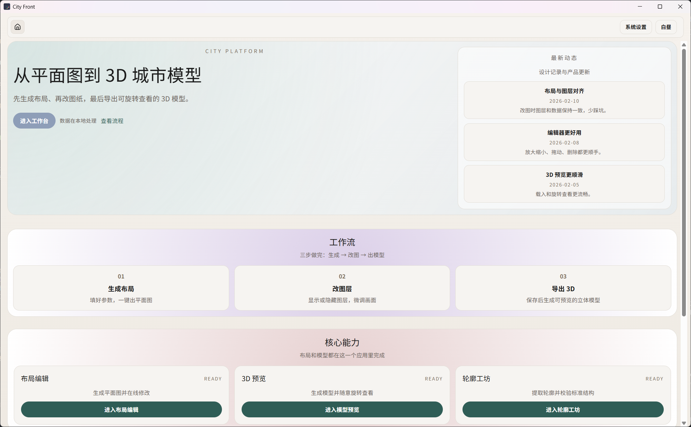

### 参数化布局生成页面

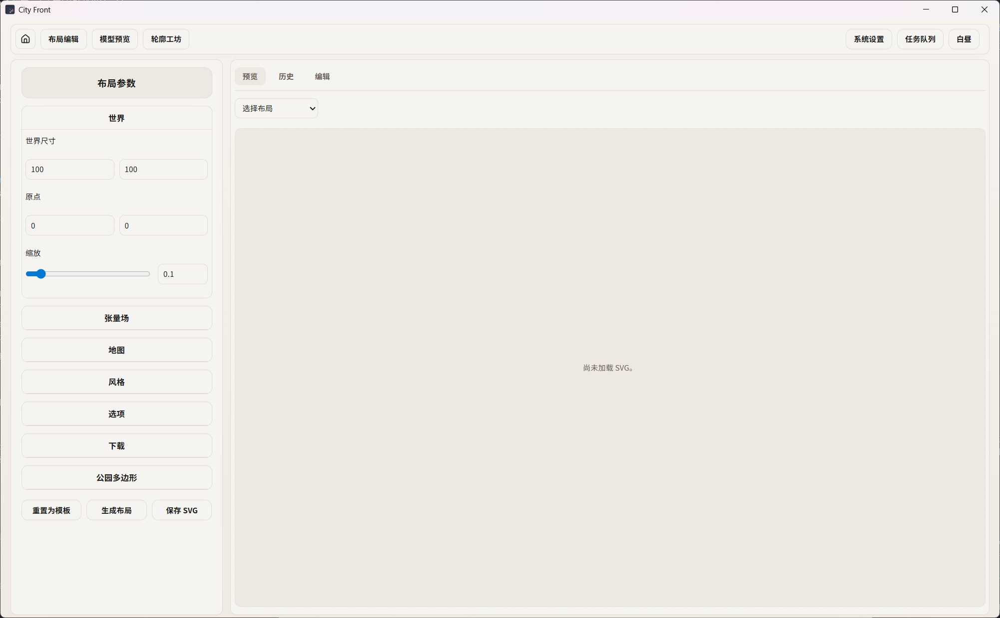

### 布局生成后预览界面

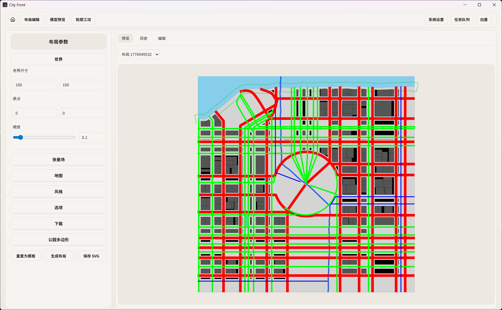

### 布局列表截图

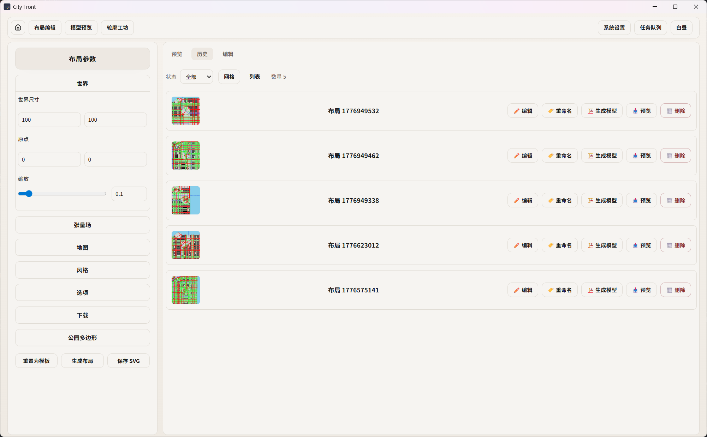

### 布局编辑页面截图

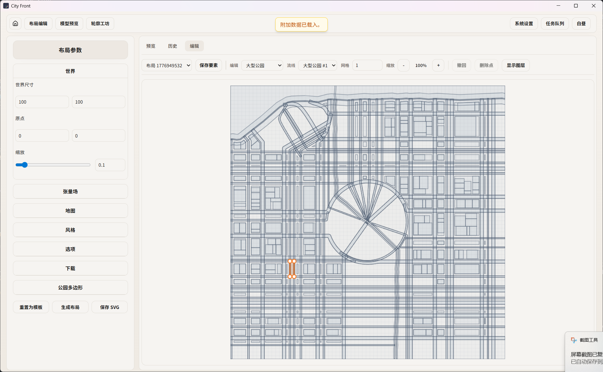

### 模型生成后预览界面，且可修改材质

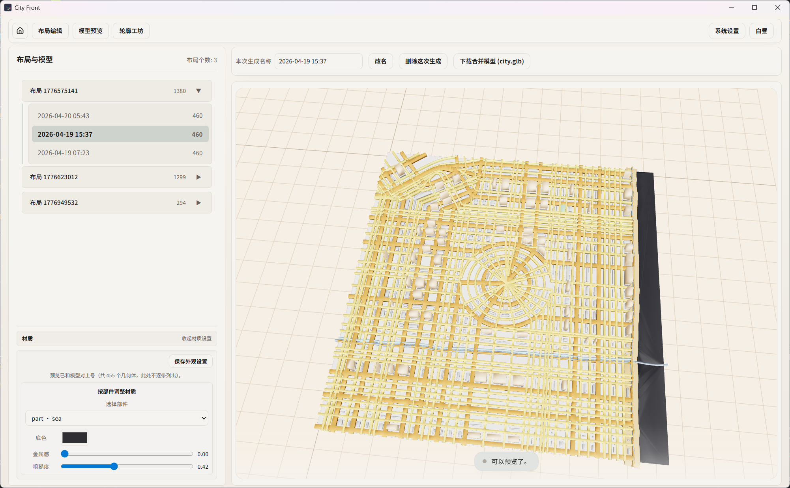

## 轮廓提取

### 轮廓提取操作界面

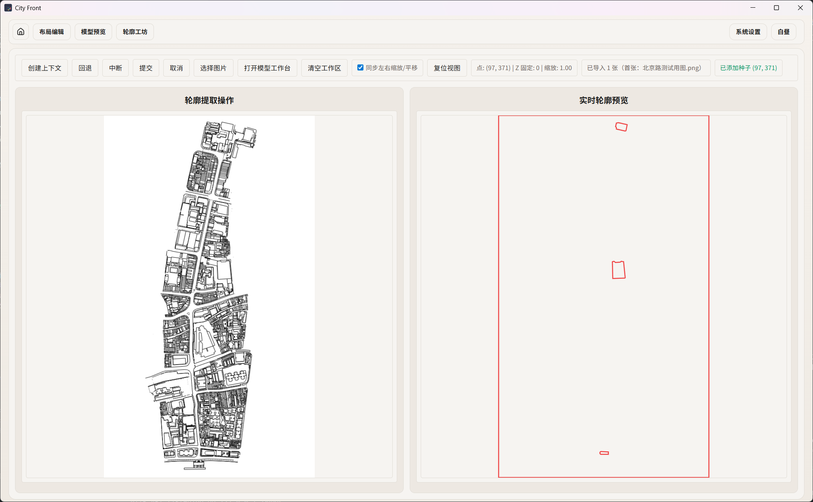

### 轮廓编辑

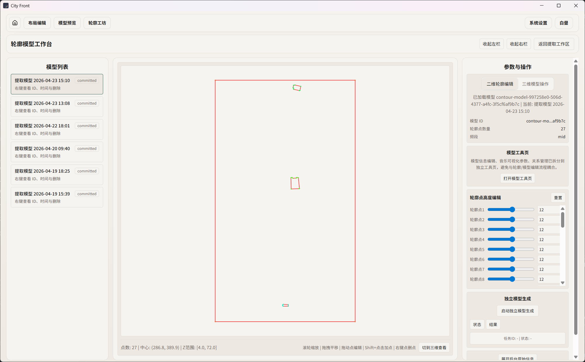

### 三维预览界面

可调节点高度

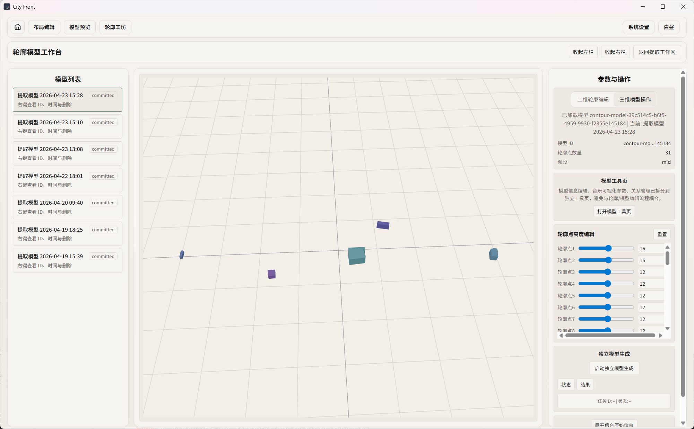

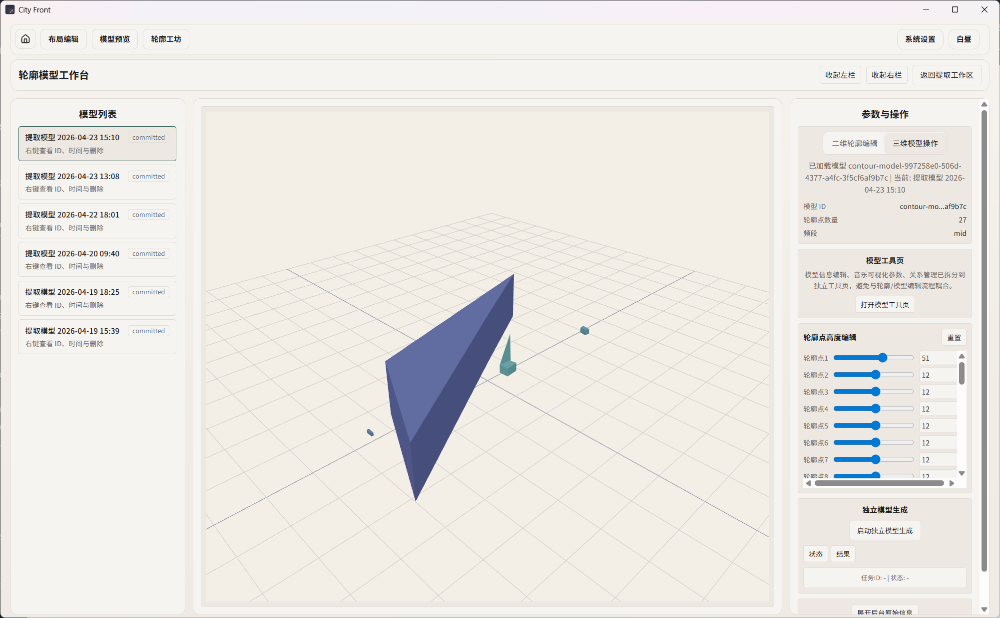

### 三维模型信息化编辑

#### 音乐可视化

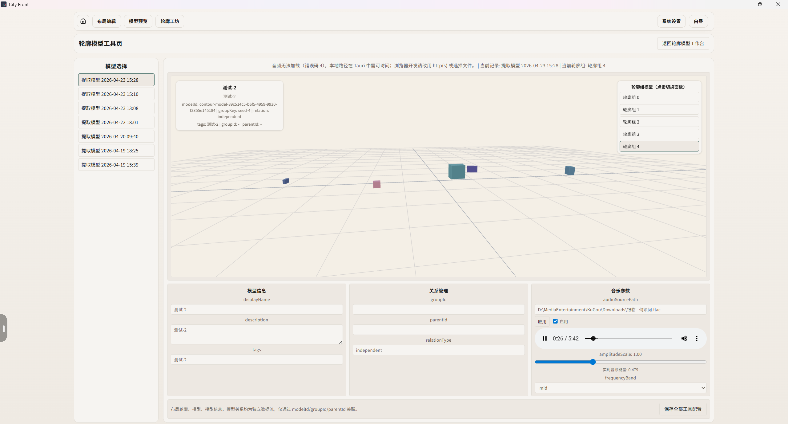

#### 模型选中和信息绑定

信息一

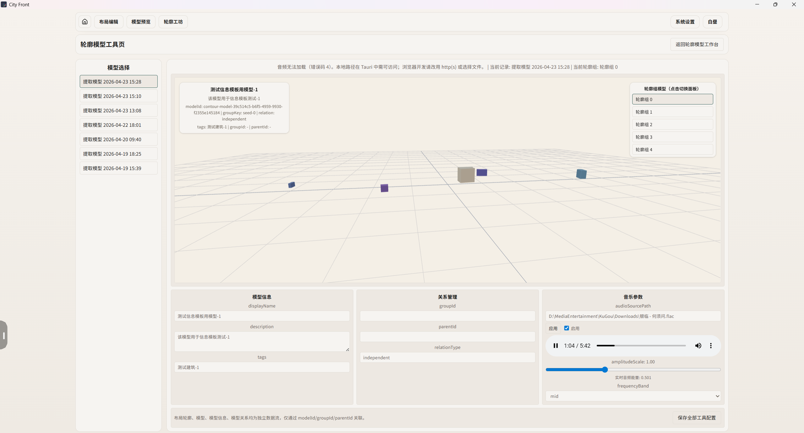

信息二

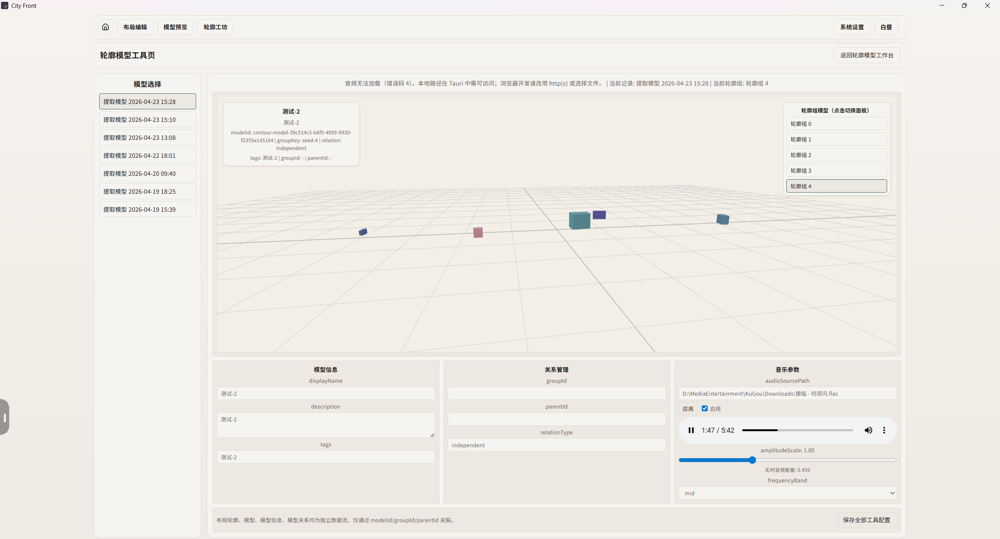

## 其它

### 昼夜模型

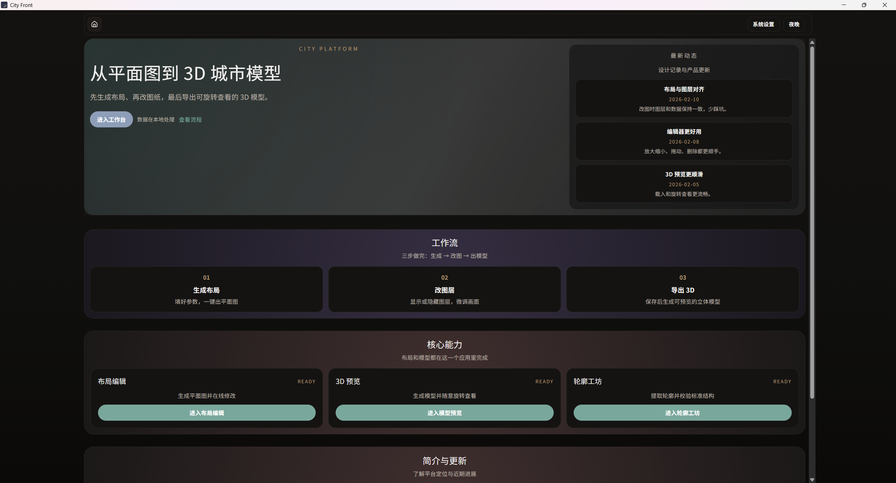

### 系统设置

关于存储路径以及开发者模型等等

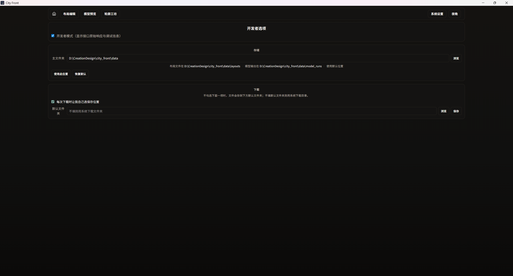

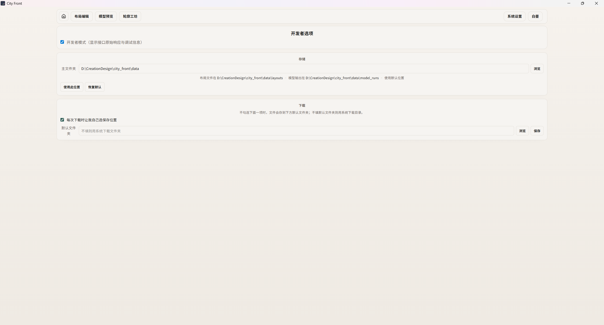