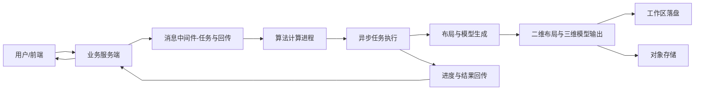
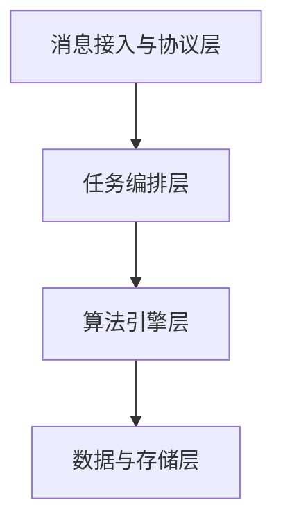
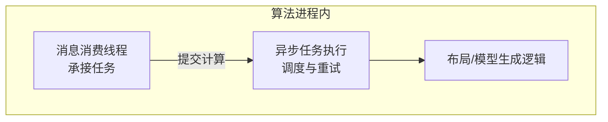
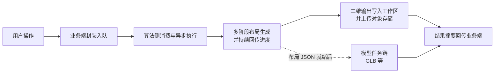

# 摘要


## 摘要

在大规模虚拟环境构建中，如何高效生成具备特定逻辑与美学特征的建筑群落始终是业界的难题。传统的纯手工建模效率低下，而生成式 AI（AIGC）在处理 **3D 建筑群落** 时常面临 **拓扑破碎、语义缺失及黑盒不可控** 等问题，难以还原非遗街区、自然村落或现代都市等不同地貌的深层空间规律。针对此需求，本文设计并实现了一套基于 **张量场（Tensor Field）与流线积分算法** 的参数化风格群落生成系统。

本系统采用 **“逻辑驱动布局”** 的核心思路，利用张量场宏观引导空间纹理，通过二阶龙格-库塔流线算法自动化生成具备严谨结构逻辑的骨架网络。研究内容涵盖：基于多边形递归切分的多维地块划分、针对复杂水体与生态空间的程序化模拟、以及建筑底面轮廓的参数化优化。实验证明，系统通过开放 `dsep` 等核心控制参数，能够高效产出轻量化、拓扑严谨的 **建筑群落粗模（Building Massing/Whitebox）**。该方案构建了“先物理约束底座、后多元风格填充”的工业化管线，不仅适用于城市规划，更能为非遗保护、乡村振兴及游戏场景设计预留精准的空间语义约束，显著降低了后期资产填充的修正成本。

关键词：程序化生成；张量场；流线算法；城市街区；布局生成；三维建模


## Abstract

### 中文部分

**摘要：**

在大规模虚拟环境构建中，如何高效生成具备特定逻辑与美学特征的建筑群落始终是工业界的难题。传统的纯手工建模效率低下，而生成式 AI（AIGC）在处理 3D 建筑群落时常面临 **拓扑破碎、语义缺失及黑盒不可控** 等问题，难以还原非遗街区、自然村落或现代都市等不同地貌的深层空间规律。针对此需求，本文设计并实现了一套基于 **张量场（Tensor Field）与流线积分算法** 的参数化 2D 风格群落生成系统。

本系统摒弃了不可控的生成模式，采用 **“逻辑驱动布局”** 的核心思路：利用张量场宏观引导空间纹理，通过二阶龙格-库塔流线算法自动化生成具备严谨结构逻辑的骨架网络。研究内容涵盖：基于多边形递归切分的多维地块划分、针对复杂水体与生态空间的程序化模拟、以及建筑底面轮廓的参数化优化。实验证明，系统通过开放 `dsep` 等核心控制参数，能够高效产出轻量化、拓扑严谨的 **建筑群落粗模（Whitebox）**。该方案构建了“先物理约束底座、后多元风格填充”的工业化管线，不仅适用于城市规划，更能为非遗保护、乡村振兴及游戏场景设计预留精准的空间语义约束，显著降低了后期资产填充的修正成本。

**关键词：** 程序化内容生成；张量场；流线算法；建筑群落；布局生成；建筑粗模

### English Version

Constructing large-scale virtual environments with specific logical and aesthetic characteristics for building settlements remains a significant industrial challenge. Traditional manual modeling is inefficient, while Generative AI (AIGC) often faces "black-box" limitations such as **fragmented topology, missing semantic data, and uncontrollability** when handling 3D clusters. These limitations hinder the restoration of deep-seated spatial rules found in diverse landscapes like intangible heritage districts, rural settlements, or modern metropolises. Addressing these needs, this paper designs and implements a parametric 2D-style settlement generation system based on **Tensor Fields** and **Streamline Integration** algorithms.

The system moves away from uncontrollable patterns in favor of a **"logic-driven layout"** approach: it utilizes tensor fields for macroscopic guidance of spatial textures and employs second-order Runge-Kutta streamline algorithms to automatically generate skeleton networks with rigorous structural logic. The research encompasses: multi-dimensional parcel partitioning via recursive polygon subdivision, procedural simulation of complex water bodies and ecological spaces, and parametric optimization of building footprints. Experimental results demonstrate that by exposing core control parameters such as `dsep`, the system efficiently produces lightweight, topologically rigorous **building massing (Whitebox)**. By establishing an industrial pipeline of "constructing a physical constraint foundation before multi-style functional filling," this solution provides precise spatial semantic constraints for urban planning, heritage conservation, rural revitalization, and game scene design, significantly reducing the cost of post-processing asset population.

**Keywords:** Procedural Content Generation (PCG); Tensor Field; Streamline Algorithm; Building Settlements; Layout Generation; Building Massing


# 三维模型生成以及可视化交互系统设计与实现

## 引言

随着数字孪生、游戏场景生产与城市仿真应用的快速发展，行业对「可控、可解释、可复现」的空间生成能力提出了更高要求。与端到端黑盒生成不同，本文采用“参数约束 + 几何推演”的技术路线：以前端交互承载参数输入与结果编辑，以业务端负责任务治理与资产管理，以 Python 算法服务端完成张量场建模、流线积分、地块细分及基于布局 JSON 的三维挤出导出，形成从二维布局到三维白模资产的完整闭环。本文后续章节将依次介绍研究背景与问题定义、系统架构与交互设计、业务端与算法端实现、实验结果与性能分析，并在结论中总结当前能力与后续优化方向。

## 第一章 绪论

### 研究背景

在本课题面向的参数化街区生成与可视化交互场景中，核心需求是以较低人工成本快速产出结构合理、可编辑、可复现的二维布局与三维白模资产。然而现有常见建模路线在「生成效率、语义可控性与结果可复用性」之间仍存在明显矛盾：

1. **传统人工建模与 AIGC 的双重困境：** 纯手工建模周期长、成本高，难以应对动态生成的迭代需求。而近年来兴起的生成式人工智能（AIGC）虽然视觉表现力强，但在 **3D 建筑群落** 的系统化构建中存在局限：AI 生成的模型往往伴随着 **拓扑结构破碎、面数冗余** 等技术硬伤，且缺乏明确的语义逻辑。这种“黑盒”机制难以进行精确的参数化干预，导致生成的场景往往与真实的物理规则、建筑规范或特定设计意图相悖。
2. **复杂建筑群落布局的严谨性需求：** 无论是现代城市街道、传统非遗街区还是自然村落，其布局并非随机分布，而是深受地形、水系、交通路网及特定 **营造法式** 的约束。通用 AI 模型因缺乏对底层空间逻辑的理解，生成的布局往往“神似而形散”，无法还原不同建筑群落内在的轴线关系、空间渗透与纹理肌理。

#### 研究意义

本课题旨在设计并实现一套基于 **张量场（Tensor Field）与流线（Streamline）算法** 的参数化驱动 2D 风格街区生成系统。本研究专注于 **高质量空间布局与建筑粗模（Building Massing）** 的逻辑构建，其意义体现在以下三个维度：

1. **实现高度透明的“白盒化”逻辑控制：** 不同于 AI 生成的不可解释性，本系统采用 **传统程序化生成（PCG）** 路线，利用张量场作为宏观方向引导，通过欧拉法或龙格库塔法进行流线积分，模拟出具有有机流动感的道路与水系。这种“参数驱动”模式允许开发者通过调整 `dsep`（间距）、`dtest`（碰撞检测）等数值，实现对城市骨架的精确干预，确保从主干道到末梢巷弄的产生都有迹可循。
2. **优化大规模场景的部署性能与兼容性：** 系统生成的建筑地块基于递归切分与多边形收缩算法，产出的是轻量化的 **矢量化粗模（Whitebox）数据**。相比于 AI 生成的沉重模型，这种粗模极大地降低了渲染初期的计算负载，能够无缝对接游戏引擎的实例化技术。这种“先占位、后填充”的策略，为在移动端或实时交互环境中大规模部署复杂的建筑群落提供了性能保障。
3. **为多样化群落形态还原提供科学的空间约束：** 本研究的核心价值在于 **“为精准填充预留空间”**。通过程序逻辑预设建筑的退线、朝向及空间间距，系统生成的粗模为后续填充高精度建筑模型（如现代商业建筑、中式非遗古建或乡村民居）提供了坚实的底层蓝图，因而允许最终生成的建筑群兼具视觉美观性和通用扩展性。

### 国内外研究现状

####  国外研究现状

程序化城市生成的研究可以追溯到 20 世纪 90 年代。**Parish 和 Müller (2001)** 发表了经典论文《Procedural modeling of cities》，提出了基于 **L 系统** 的生成方法 CityEngine。该方法通过扩展语法模拟道路的生长，但结果多呈树状，缺乏复杂的环状结构。

**Kelly 和 McCabe** 随后提出了基于 **图语法（Graph Grammar）** 的方法，通过定义图重写规则演化道路网络，增强了拓扑复杂度，但在处理自然曲线形状上仍有不足。

基于 **张量场（Tensor Field）** 的方法由 \**Chen 等人 (2008)\** 引入。该系统允许用户通过绘制向量场引导道路走向，利用流线积分生成网络，实现了宏观控制与局部细节的分离。此技术后来成为行业标准。在河流生成方面，**Galbraith 等人** 利用张量场模拟地形侵蚀，取得了高度自然的效果。近年来，国外研究开始关注 **波函数坍缩算法（WFC）** 与反向设计方法，试图从真实城市数据中学习统计特征以驱动生成。

#### 国内研究现状

国内在该领域的研究起步较晚，但近年来在 **数字孪生与智慧城市** 背景下发展迅速。北京大学的 **Wang 等人** 提出了基于分层张量场的道路生成方法，实现了多尺度控制。浙江大学的 **Hua 等人** 将元胞自动机与张量场结合，模拟城市的动态扩张。

目前，国内研究多集中于利用地理信息系统（GIS）进行真实场景还原，或者利用深度学习（如 GAN）生成城市图像布局。然而，针对 **“具有艺术风格化且逻辑高度可控”** 的 3D 空间底座生成研究仍处于探索阶段。

### 现有研究不足与拟解决的关键问题

#### 现有研究不足

1. **布局与填充的深度耦合**：多数方法侧重于单一生成，缺乏“先构建空间底座、后进行功能填充”的阶梯式开发思维。
2. **参数体系与美学控制脱节**：用户需要调整大量底层数学参数，难以直观地控制生成结果的艺术风格或空间纹理。
3. **多元素协同生成的逻辑缺失**：对道路、水体、地块及建筑之间的相互约束与协同考虑不足，导致生成场景缺乏有机感。

#### 拟解决的关键问题

1. **空间纹理的参数化映射**：如何通过张量场的场强与特征点分布，直观映射出如网格状、放射状或有机状的城市肌理。
2. **拓扑严谨的地块划分**：如何在流线网格的基础上，实现异形多边形的递归切分与退线处理，确保生成的建筑底面符合真实营造逻辑。
3. **高效的计算与数据流转**：如何在保证几何质量的前提下，实现异步计算与轻量化资产的存储分发。

### 本研究的设想与主要内容

#### 研究设想

本文提出一种“逻辑驱动布局”的程序化生成框架，即通过构建一套 **“参数输入 -> 布局演算 -> 交互微调 -> 三维实例化”** 的完整管线，将宏观的数学场引导与微观的多边形切分相结合，生成具备物理约束和空间语义的建筑群落粗模。

#### 主要研究内容

1. **基于张量场与流线的布局引擎**：设计支持网格场、径向场与噪声场叠加的构建方法，利用二阶龙格-库塔法进行流线积分，并引入 R 树索引优化碰撞检测性能。
2. **地块识别与多边形处理算法**：实现基于图遍历的地块提取逻辑，开发针对异形地块的递归切分与多边形收缩算法。
3. **参数化控制与 Whitebox 构建系统**：基于 Pydantic 设计灵活的配置体系，将 2D 布局转化为带有高度、朝向等语义信息的 3D 几何实体。
4. **跨平台系统集成与验证**：构建前后端分离的系统架构，通过多个风格实验案例验证系统在可控性与多样性上的表现。

#### 达到的要求

系统应能够在几分钟内生成包含上千个地块的大规模街区底图，支持对布局的编辑，最终产出的 3D 模型具备完整的拓扑结构，且能够通过参数调整直观改变布局风格，满足游戏场景或城市规划的快速原型设计需求。

### 论文结构

本文共分为七章。第一章为绪论，介绍研究背景、研究意义、国内外研究现状以及本文拟解决的关键问题。第二章为业务需求分析与系统架构，明确系统目标、功能需求与总体技术路线。第三章为前端交互设计，说明参数配置、二维布局编辑与三维预览等核心交互流程。第四章为业务端架构设计，阐述任务管理、接口组织与异步协作机制。第五章为算法服务端架构设计，重点介绍张量场建模、流线生成、地块识别、三维挤出导出及数据流组织。第六章为实验过程与结果分析，展示不同参数下的生成效果并分析性能与局限。第七章为结论与展望，总结本文工作并提出后续优化方向。

## 第二章 业务需求分析与系统架构

### 业务需求分析

本系统旨在解决复杂建筑群落从“抽象规则”到“三维实体”的高效转化问题，重点满足以下核心业务流程需求：

- **参数化快速原型需求：** 用户能够通过预设数学参数（如张量场特征、道路密度 `dsep` 等）快速生成初始街区布局，替代低效的手工草绘，实现从零到一的自动化生长。
- **交互式布局编辑需求：** 系统需提供直观的可视化编辑界面，支持用户对自动生成的 2D 布局进行二次干预（如调整特征点、修改流线走向），确保生成结果符合特定的设计审美或空间逻辑。
- **自动化三维建模需求：** 在 2D 布局确定的基础上，系统需具备一键生成 3D 建筑粗模（Whitebox）的能力。通过程序化算法自动完成地块切分、退线处理及体量拉伸，生成具备物理约束的几何空间。
- **计算与展示的流畅性需求：** 鉴于流线积分与几何切分的计算开销，业务流程要求系统具备高效的异步处理能力，确保在生成大规模场景时，前端操作依然流畅，并能实时反馈计算进度。

### 系统整体架构设计

为支撑“参数生成 -> 可视化编辑 -> 三维建模”的业务闭环，系统采用了 **解耦化、异步驱动** 的分层架构：


#### 前端交互层 (React Web)

作为用户操作的直观载体，负责业务流的开启与结果反馈。

- **参数配置模块：** 提供交互式面板，用于输入张量场及算法核心参数。
- **可视化画布：** 实时渲染 2D 张量场与道路网格，支持用户手动编辑布局矢量图形。
- **3D 预览模块：** 加载生成的建筑粗模文件，提供直观的三维场景模型渲染。

#### 业务调度与后端服务层 (Spring Boot)

充当系统的逻辑中枢，负责管理数据流转。

- **任务管理：** 接收前端请求，将其封装为计算任务，并监控生成进度。
- **业务状态存储：** 利用 **MySQL** 记录用户配置、布局版本及生成状态。
- **异步调度：** 引入 **RabbitMQ** 消息中间件，将重度计算任务分发至算法后端，避免前端同步等待产生的假死现象。

#### 核心算法引擎层 (Python Engine)

执行最底层的数学运算与几何转换。

- **布局生成引擎：** 运行张量场构建与二阶龙格-库塔流线积分算法，生成初步路网。
- **几何处理模块：** 执行右手法则地块识别、多边形递归切分、地块收缩等操作，将线稿转化为具有拓扑逻辑的平面布局。
- **3D 实体构建：** 负责 3D 几何体的拉伸与空间语义填充，产出标准化的建筑粗模数据。

#### 数据存储与资产管理层 (MinIO & MySQL)

- **MinIO 对象存储：** 专门用于存储生成的 `.glb` 格式模型文件及大型配置文件，通过 URL 提供给前端进行模型获取。
- **MySQL 数据库：** 存储结构化的业务数据，确保用户可以随时回溯或导出已生成的布局资产。

### 业务流程说明

1. **参数引导：** 用户在 **React** 端设置场特征，请求通过 **Spring** 推送至 **RabbitMQ**。
2. **布局演算：** **Python** 核心执行流线生成，将结果存入 **MinIO** 并返回 2D 预览。
3. **交互微调：** 用户在画布上编辑布局，系统实时更新参数并触发增量计算。
4. **三维实例化：** 确认布局后，系统触发建模逻辑，自动切分地块并生成 3D 粗模，最终由前端从 **MinIO** 获取模型进行展示。

## 第三章 前端交互设计


### 首页

首页是系统的统一入口，承担三项任务：价值传达、流程说明、功能分发。用户可先理解“SVG 布局到 3D 模型”的完整流程，再进入具体功能模块。如图所示，首页风格简约，表明产品功能和工作流程，并列明近期改动状态。


#### 布局结构

页面采用自上而下的分区结构：

1. 首屏区（Hero）：品牌标题、产品简介、主操作按钮（登录/注册或进入工作台）。
2. 流程区：三步流程（生成布局、分层编辑、转换模型），帮助用户快速建立认知。
3. 能力区：三个核心模块卡片（布局编辑、模型预览、个人中心），支持一键跳转。
4. 更新与说明区：展示近期动态和平台简介，补充系统背景信息。
5. 页脚区：品牌与流程标识，形成信息收束。

#### 主要功能

1. 登录态联动：根据用户是否登录，动态切换按钮文案与可访问路径。
2. 权限引导：未登录访问受限模块时，自动引导至登录页，降低操作中断感。
3. 主题切换：支持明暗主题，提升可读性与环境适配性。

### 布局生成/编辑页

布局生成/编辑页通过左参右景、多 Tab 分工和与列表/模型链路的贯通，在单一工作台内支撑从「参数生成」到「二维编辑与资产沉淀」的完整闭环。

其实是产品的核心工作台，在单页内完成了参数化生成布局、SVG 预览、历史布局管理和布局矢量化编辑功能，并与三维模型生成衔接。


#### 信息架构（左右分栏）

1. 左侧：布局参数区
   以可折叠分组（如世界尺寸、张量场、地图、样式、选项、导出、公园多边形等）组织生成参数；提供恢复模板、生成布局、保存 SVG 等操作，并展示生成状态与错误提示。生成过程通过轮询进度接口，将后端阶段映射为可读文案与进度反馈。
2. 右侧：工作区（Tab）
   1. 预览：当前布局的 SVG 预览，支持从下拉列表切换已有布局。
   2. 文本：基于 URL 的 SVG 文本编辑，便于直接改源码。
   3. 历史：布局列表（筛选状态、网格/列表视图、SVG 缩略图），支持编辑、加载、删除及生成 3D 模型等快捷操作。
   4. 编辑（要素）：基于 JSON 的 Artifacts 多边形编辑（如增删改点、保存回写），与布局选择器联动。

#### 主要功能

1. 参数化生成：提供美观便捷的参数表单，发送 `LayoutGenerateRequest` 触发布局生成；未登录时拦截并提示。
2. 状态与数据同步：使用 Redux 维护当前 `layout_id`、SVG 内容与 URL，便于跨组件与弹窗共用。
3. 历史与复用：列表拉取用户布局，一键加载到预览界面或打开可视化编辑。
4. 三维衔接：在历史列表中可对指定布局触发模型生成任务（与模型预览页形成流水线）。

#### 设计巧思

1. 「参数—预览—源码—资产—要素」分层：用 Tab 把看结果、改代码、管历史、改结构化数据拆开，降低单屏认知负荷。
2. 历史列表增强：状态筛选、视图切换、服务端 SVG 拉取作缩略图，兼顾效率与操作密度。
3. 生成过程可感知：渲染 `轮询进度 + 阶段提示词` 组件，减轻长任务等待焦虑。

### 模型预览

模型预览页是「布局 → 三维」链路的终端环节，通过侧栏组织数据与任务、主区承载三维交互，在浏览器内完成从服务端模型资产到可观测三维结果的展示。


#### 界面结构

- 侧栏（控制区）：展示「布局与模型」树状/列表信息（布局数量、各布局下模型数），支持布局模型选择；提供下载当前布局相关模型操作。
- 主区（预览区）：使用 Three.js 库，对可渲染的 GLB 格式场景模型进行加载；轨道控制器（OrbitControls） 支持旋转、缩放观察；场景含光照与网格地面，增强空间参照。

#### 主要功能

- 列表与缓存：进入页面拉取 `listModels`，将「布局—模型」关系写入 Redux，并按所选布局顺序拉取各模型文件元数据；本地缓存减少重复请求。
- 格式策略：GLB 优先用于 WebGL 直接加载；对名为 `city.glb` 的整城资源作区分（通常用于下载而非主预览），避免与可分块预览的 GLB 混淆。

## 第四章 业务端架构设计

本系统业务端面向城市三维业务场景，采用 B/S 架构，业务服务端以 Spring Boot 为核心构建单体应用（`layout` 模块），对外提供 RESTful HTTP 接口，对内通过 关系型数据库 持久化核心业务数据，并通过 消息队列与外部计算进程解耦，实现与布局生成与三维模型等长耗时任务的异步协作。


### 逻辑结构

系统遵循经典 分层架构：表现层负责接收 HTTP 请求、参数校验与统一响应封装；应用服务层承载领域流程编排、业务规则与事务边界；数据访问层基于 MyBatis-Plus 完成实体与数据库表的映射与访问；基础设施层则集成消息中间件、对象存储、安全认证 等横切能力。该划分有利于职责清晰、便于测试与后续演进。

### 异步协作

本系统以 RabbitMQ 作为实际使用的消息总线：应用通过交换机与路由键将任务消息投递至相应队列，由外部 Worker 消费执行；执行过程中的进度与结果同样经队列回传至本应用，由监听器组件消费并更新任务状态与业务数据。任务与回传消息采用 Protocol Buffers 序列化，以保证跨进程、跨语言场景下的结构约束与演进能力。对象资源（如生成物访问）由 MinIO 提供存储与预签名访问能力；业务主数据则持久化至 MySQL。接口访问采用 JWT 与 Spring Security 进行认证与授权控制。

整体上，本架构在保持 Web 层简洁可维护的前提下，通过消息队列 + Protobuf 实现与重计算/渲染子系统的松耦合，通过 数据库 + 对象存储 分别承载结构化数据与大对象资源，通过 统一安全机制 保障接口访问安全，为城市业务相关功能的稳定扩展提供了清晰的技术基础。

## 第五章 算法服务端架构设计

该模块在整体系统中承担**程序化布局与三维模型生成**职责，采用「**消息接入与协议**—**任务编排**—**算法引擎**—**数据与存储**」四层逻辑划分：对上通过消息中间件与**业务服务端**协作，对下将城市参数转化为二维矢量与结构化布局描述，再导出为**三维模型文件**（如 GLB）。算法侧实现为**独立 Python 计算进程**，**不直接面向浏览器提供主 REST 接口**；用户鉴权、任务落库与资源授权由业务端完成，算法进程专注于**订阅任务、执行长时计算、回传进度与结果**，并将**生成的布局与模型文件**交由**对象存储**持久化。技术选型上，任务异步调度采用 **Celery**，消息与回传走 **RabbitMQ**，结构化参数与跨语言契约采用 **Protobuf**。


### 核心设计目标

1. **职责分离**：将「接入、权限与业务状态」保留在业务端，将「重计算与几何生成」隔离在算法进程中，二者仅通过**消息契约**与**存储路径约定**交互，避免 Web 层与计算层相互拖累。布局生成与三维导出在逻辑上分为**两类异步任务**，便于独立扩容与失败隔离。
2. **过程可观测**：将复杂生成拆解为**多个顺序阶段**（自张量场与水域，经道路与公园，再到地块、建筑与导出），每阶段可向业务端回报**阶段名与进度**，既方便前端展示，也便于定位失败环节，而无需把整段流水线写成单一黑箱。
3. **表示统一**：二维结果以**布局 JSON / 矢量**等形式固定为中间表示，三维导出**仅依赖该中间表示**即可复现或增量更新模型，从而在「自动生成—人工编辑—再生成」闭环中保持稳定接口。


### 系统级协作关系

从**角色与数据去向**看，业务端承担对外接口与任务状态；算法进程通过**消息中间件**接收任务并回传进度与结果；生成文件进入**工作区**与**对象存储**。其关系可概括为下图。




### 分层架构

算法服务内部划分为四层，自上而下体现**依赖方向**（上层不直接操作底层几何细节，而通过编排与契约调用）。

1. **消息接入与协议层**：定义算法进程与业务世界的边界——**只认消息契约，不认浏览器会话**；负责解析任务、触发异步执行，并将进度/结果封装为回传消息。
2. **任务编排层**：衔接消息与具体计算，统一处理**布局任务**与**模型任务**的差异（输入路径、输出类型、上报字段），并调用底层生成例程。
3. **算法引擎层**：实现张量场、流线、水系、路网抽象、地块与建筑等**领域算法**，对编排层暴露为**阶段化过程**，内部可自由组合数据结构而不泄漏给消息层。
4. **数据与存储层**：将外部 JSON/消息反序列化为强类型参数模型；管理**工作目录**与**对象存储**中**生成文件**的存储与命名策略，使业务端可用稳定 URL 或键访问资源。

四层之间的依赖方向如下图所示（自上而下调用底层能力，数据与存储为各层提供参数与落盘支撑）。




### 阶段化流水线

布局生成在设计上被拆为**前后依赖的多个阶段**，其顺序体现城市要素由粗到细的构建逻辑：**全局张量场与水域骨架**奠定空间结构，三层道路网络逐步形成并细化可区划的开放空间，**地块与建筑**在几何上「填充」剩余区域，最后**导出可供编辑与渲染的二维布局输出文件**（矢量与 JSON 等）。任一阶段失败时，优先通过进度通道反馈**失败阶段与原因**，而不是在客户端呈现笼统错误，以利于运维与参数调优。

下表从**业务语义**概括各阶段；实现上自**第 0 阶段至第 8 阶段**顺序执行，下表第一列给出与实现编号一致的序号。

| 编号 | 阶段主题 | 说明 |
|------|----------|------|
| 0 | 全局场与约束初始化 | 根据参数建立张量场等全局引导场，为后续流线与水系提供方向与强度信息 |
| 1 | 水岸线生成 | 形成海岸线与主河流水系骨架 |
| 2 | 水域与相关区域 | 将线状水系提升为面状水域及附属结构，作为道路与地块的障碍/边界来源 |
| 3 | 主要道路与主干道 | 生成城市主结构道路网络 |
| 4 | 大型公园 | 在道路结构基础上嵌入大型绿地 |
| 5 | 次级道路与流线汇总 | 补充次级道路并与水系等流线统一，为全局几何一致做准备 |
| 6 | 小型公园与辅助输出 | 细化小型绿地及必要的中间可视化或诊断信息 |
| 7 | 地块、建筑与布局组装 | 对道路与水岸做宽度等几何处理，划分地块与建筑占位，组装统一布局对象 |
| 8 | 二维布局文件导出 | 输出矢量预览与机器可读的布局 JSON，作为后续三维与编辑的结构化入口 |

三维模型任务则读取上述 **JSON**，完成**网格构建与 GLB 导出**，结果仍经消息与存储通道交回业务端；三维构建与上表各阶段**任务级解耦**，仅在布局中间表示就绪后启动。


### 功能子系统划分

算法侧可划分为六个相互衔接的功能子系统。划分原则有二：一是**几何与领域逻辑**集中于前五个子系统，**对外通信与文件落盘**由最后一个子系统统一代理；二是相邻子系统之间通过**明确的数据契约**交接（如张量场采样结果、流线折线集、图结构、地块多边形列表、布局 JSON 等），避免跨层随意耦合。

| 子系统 | 主要职责 | 与其它部分的关系 |
|--------|----------|------------------|
| 张量场与流线 | 建立全局方向场，并在场上积分生成道路、水系等线状要素的骨架 | 为水体与路网提供统一的方向与采样接口 |
| 水体 | 在岸线、河流等约束下形成海岸线、河流中心线及缓冲后的水域多边形 | 为道路积分与地块过滤提供障碍与边界语义 |
| 路网与地块 | 将流线提升为图结构，查找闭合区域，区分可建地块与开放空间 | 承接流线输出，向建筑与公园提供候选区域 |
| 建筑与布局汇总、导出 | 在建筑尺度切分与占位，汇总全图矢量与属性，输出 **SVG / JSON** | 形成二维布局的**唯一结构化描述**，供编辑与三维任务消费 |
| 三维模型生成 | 以布局 JSON 为输入，构建三角网格与城市构件，输出 **GLB** 等 | 与布局生成**任务级解耦**，仅依赖中间文件 |
| 任务调度与存储 | 消息触发、异步执行、工作目录与对象存储中的**生成文件**管理 | 将运行时细节与上述领域子系统隔离 |


### 进程模型与协作关系

算法进程在运行形态上体现为**长期驻留的服务**：一侧以**轻量消息消费**线程承接业务端投递的布局或模型任务，避免阻塞；另一侧将实际计算交给**异步任务框架**执行，以利用多任务调度与失败重试等通用能力。这样设计的目的在于：消息到达速率与单任务耗时解耦，系统可在**吞吐**与**资源占用**之间取得平衡，并与业务端通过消息通道投递任务、监听回传的习惯用法一致。

**与业务端的分工**可概括为：业务端负责任务生命周期（创建、查询、取消意图等）与面向用户的接口；算法端负责**参数落地、几何计算、生成文件落盘**（布局与模型）以及**向消息通道发布进度与结果**。二者不共享同一进程空间，有利于在部署上将计算节点横向扩展。

算法进程内部的典型结构可概括为：消息到达不阻塞主计算路径，由消费线程承接并转交异步执行层，再进入具体生成逻辑。




### 通信与数据流

任务与回传均经由**统一消息交换机**投递，载荷采用**二进制序列化协议**，以保证跨语言字段一致、版本可演进。进度消息携带**阶段语义与完成度**，结果消息携带**产出访问路径**，由业务端监听器写入数据库并驱动前端展示，从而形成「提交—执行—可见反馈」的闭环。

生成产物包括**参数快照、二维布局描述、矢量预览、三维模型文件**等；其中需长期保存、经 HTTP 访问的部分进入**对象存储**，本地目录更多承担**计算过程工作区**角色。三维导出在数据流上被视为**继二维之后的第二条任务链**：仅当布局中间表示就绪后，才触发模型构建，避免两阶段强耦合在同一调用栈内。

任务、进度与结果在消息层与存储层之间的大致关系如下（业务端既发任务也监听回传；算法端读写工作区并可将大文件同步至对象存储）。


### 端到端业务流程

用户经业务端提交生成请求后，服务端将任务封装为消息投递至消息中间件；算法进程消费消息后，将**布局类任务**调度为**多阶段顺序执行**，阶段之间持续**发布进度**；阶段全部完成后，将**二维布局生成文件**写入工作区并**同步至对象存储**，再通过**结果消息**告知业务端可访问路径。**模型类任务**在拿到**布局 JSON 路径**与输出目录后独立执行，生成 **GLB 等三维模型文件**，同样通过回传通道交付。全过程**不经过算法进程对外 REST 鉴权**，身份与任务状态由业务端统一维护。

从请求到结果的主干步骤可概括为下图（布局链与模型链在任务上相互独立，模型链依赖布局 JSON 就绪）。




### 核心算法原理综述

以下各节从**数学模型与算法步骤**展开，依次阐述：**张量场建模与流线积分**、**水体与缓冲几何**、**路网图构建与地块识别**、**建筑与公园等要素处理**，以及**基于布局 JSON 的三维挤出与 GLB 导出**（与布局链**任务级解耦**，仅消费二维中间表示）。其顺序与上文**阶段化流水线**在概念上对齐：先建立**宏观场与骨架网络**，再处理**区域划分与语义过滤**，形成**可持久化、可编辑的二维布局描述**；三维任务在布局 JSON 就绪后独立执行，将平面语义抬升为**三角网格与场景资产**。**文中保留主要定义式与可实现的离散形式**，**不作冗长证明**；各模块在给出公式后，用少量文字归纳**基本原理**与**在本项目中的意义**。

#### 基于张量场与流线算法的布局生成原理 

##### 张量场数学建模

**基本原理**：张量场用 2×2 对称矩阵描述各点的**主延伸方向与强度**；通过多个基础场（网格场、径向场）与可选噪声叠加，为整张地图提供一致的「生长方向」语义，后续道路、水体的流线积分均依赖场上采样的主方向。

###### 张量的数学表示

一个二维对称张量 $\mathbf{T}$ 可以表示为：

$$
\mathbf{T} = \begin{bmatrix} a & b \\ b & -a \end{bmatrix}
$$

其两个特征值为 $\pm \sqrt{a^2 + b^2}$，对应的特征向量分别代表主方向和次方向。为方便计算，通常采用参数化形式：

$$
\mathbf{T} = r \begin{bmatrix} \cos 2\theta & \sin 2\theta \\ \sin 2\theta & -\cos 2\theta \end{bmatrix}
$$

其中 $r = \sqrt{a^2 + b^2}$ 表示张量的强度（模长），$\theta$ 表示主方向与 $x$ 轴的夹角。这种表示的好处是旋转张量只需将 $\theta$ 加上旋转角即可。

实现上，张量由数据结构封装矩阵与主方向，并提供由角度构造张量、提取主方向单位向量等运算，供场采样与流线积分调用。

###### 基础场的数学定义

**网格场（Grid Field）**：网格场在指定区域施加一个统一的主方向。定义为中心点 $c = (x_c, y_c)$，影响半径 $R$，衰减系数 $\gamma$，主方向角 $\theta_0$。在点 $p$ 处的张量为：

$$
\mathbf{T}_{\text{grid}}(p) = w(p) \cdot \begin{bmatrix} \cos 2\theta_0 & \sin 2\theta_0 \\ \sin 2\theta_0 & -\cos 2\theta_0 \end{bmatrix}
$$

权重函数采用高斯衰减：

$$
w(p) = \exp\left(-\frac{\|p - c\|^2}{\gamma R^2}\right)
$$

其中 $\gamma$ 控制衰减速度，值越大衰减越快。

**径向场（Radial Field）**：径向场产生指向或背离中心的影响力。设相对位置向量 $\mathbf{v} = p - c$，则主方向应指向径向（或切向）。为生成指向中心的场，我们使用如下张量形式：

$$
\mathbf{T}_{\text{radial}}(p) = w(p) \cdot \frac{1}{\|\mathbf{v}\|^2} \begin{bmatrix} v_y^2 - v_x^2 & -2 v_x v_y \\ -2 v_x v_y & -(v_y^2 - v_x^2) \end{bmatrix}
$$

该形式使张量主方向与相对位置向量 $\mathbf{v}$ 共线（指向或背离中心由符号与用法约定），$1/\|\mathbf{v}\|^2$ 用于与分量平方项配合得到与单位径向一致的角向结构；若需改变指向，可对张量整体取反或调整权重。

###### 噪声扰动

为增加自然感和不规则性，可以向张量场中叠加旋转噪声。我们使用 Simplex 噪声生成一个连续的角度场 $\phi(p)$，然后构造噪声张量：

$$
\mathbf{T}_{\text{noise}}(p) = \alpha \cdot \begin{bmatrix} \cos 2\phi(p) & \sin 2\phi(p) \\ \sin 2\phi(p) & -\cos 2\phi(p) \end{bmatrix}
$$

其中 $\alpha$ 控制噪声强度。噪声张量与基础场张量叠加后，再重新归一化主方向（如果需要保持模长不变）。

Simplex 噪声是一种改进的 Perlin 噪声，具有更好的各向同性和连续性。我们使用 `opensimplex` 库生成噪声值，映射到 $[-\pi, \pi]$ 范围作为 $\phi(p)$。

###### 总张量场与平滑

总张量场为各基础场与噪声场的加权和：

$$
\mathbf{T}_{\text{total}}(p) = \sum_i \mathbf{T}_i(p) + \mathbf{T}_{\text{noise}}(p)
$$

由于每个基础场已经包含了权重 $w_i(p)$，所以直接相加。为了确保场的连续性，可在最终结果上应用平滑滤波。平滑通过在每个点邻域内加权平均张量矩阵实现，例如使用高斯核卷积。

###### 参数配置

张量场的参数由配置模型给出，主要包括**网格场列表**与**径向场列表**（各含中心、影响范围、衰减与方向等），并可通过全局开关控制是否在叠加后做平滑。

**在本项目中的意义**：张量场是布局生成的**第一层全局约束**——通过配置网格/径向参数与噪声，即可在少或者无手绘操作的情况下控制城市主轴、中心与有机感，并为后续所有流线提供统一的方向场。

##### 流线生成与道路网络

**基本原理**：在张量场每点取主方向为切向，对 $\frac{dp}{dt}=\mathbf{v}(p)$ 做数值积分得到折线；再经碰撞约束、简化与求交，得到可建图的道路骨架。系统支持分级道路（主干 / 主要 / 次要），差别主要体现在步长、间距阈值与迭代上限等参数。

###### 数值积分方法

给定初始种子点 $p_0$，沿张量场主方向积分。设 $\mathbf{v}(p)$ 为点 $p$ 处张量场的主方向单位向量，则流线演化满足一阶常微分方程：

$$
\frac{dp}{dt} = \mathbf{v}(p)
$$

为了在保持计算效率的同时最大程度减小累积误差，本系统采用经典的 **四阶龙格-库塔（Runge-Kutta 4th Order, RK4）方法** 进行离散求解。其迭代步进逻辑如下：

$$
\begin{aligned} \mathbf{k}_1 &= \mathbf{v}(p_k) \\ \mathbf{k}_2 &= \mathbf{v}(p_k + \frac{\Delta t}{2} \mathbf{k}_1) \\ \mathbf{k}_3 &= \mathbf{v}(p_k + \frac{\Delta t}{2} \mathbf{k}_2) \\ \mathbf{k}_4 &= \mathbf{v}(p_k + \Delta t \mathbf{k}_3) \\ p_{k+1} &= p_k + \frac{\Delta t}{6}(\mathbf{k}_1 + 2\mathbf{k}_2 + 2\mathbf{k}_3 + \mathbf{k}_4) \end{aligned}
$$

其中，$\Delta t$ 为离散步长，与实现中的步长参数一致。实现中若将中间步合并为一次等价采样，可将增量写为（与上式等价，仅记法不同）：

$$
\Delta p = \frac{\Delta t}{6} (\mathbf{k}_1 + 4\mathbf{k}_{23} + \mathbf{k}_4)
$$

其中 $\mathbf{k}_{23}$ 表示与标准 $\mathbf{k}_2$、$\mathbf{k}_3$ 两步对应的合并中间量，用于减少对张量场的重复采样。

流线生成过程采取 **双向延伸策略**：即从种子点出发，分别沿正向主方向 $+\mathbf{v}$ 和负向主方向 $-\mathbf{v}$ 同时进行积分迭代，直至触发边界限制或碰撞检测等终止条件。相比于简单的欧拉法或二阶龙格-库塔法，RK4 能够更精确地捕捉张量场中的微小曲率变化，从而生成更加平滑、自然的街道与水系轮廓。

###### 终止条件

流线在以下情况下停止延伸：

1. **超出世界边界**：点坐标超出地图范围。
2. **与现有流线距离过近**：检测到新点与已有流线点集的最小距离小于阈值 `dtest`。
3. **达到最大迭代步数**：超过 `path_iterations`。
4. **方向突变**：如果当前方向与上一方向夹角超过一定阈值。
5. 碰撞检测通过空间索引 `GridStorage` 实现。

###### 种子点生成策略

种子点的生成方式直接影响道路网络的密度和分布。系统支持两种种子点来源：

1. **初始种子点**：在张量场强度较高的区域随机采样，或沿地图边界均匀分布。采样时需满足与现有流线的距离大于 `dsep`。
2. **延伸种子点**：每条流线生成后，将其端点作为新种子点，尝试向两侧继续生成支线。这样形成层次化网络。

种子点尝试次数 `seed_tries` 控制对有效起始点的搜索努力。

###### 空间索引与碰撞检测

为高效检测新点与已有流线的距离，我们实现了一个网格空间索引 `GridStorage`。将世界划分为边长为 $d_{\text{sep}}$ 的单元格，每个单元格存储落入其中的点。查询某点附近的点时，只需检查该点所在单元格及其邻域单元格内的点，时间复杂度 $O(1)$。

设新点 $p$，需要检查是否存在已有点 $q$ 使得 $\|p-q\| < d_{\text{test}}$。首先将 $p$ 转换为网格坐标 $(i, j) = (\lfloor p_x / d_{\text{sep}} \rfloor, \lfloor p_y / d_{\text{sep}} \rfloor)$，然后遍历 $(i-1,i+1) \times (j-1,j+1)$ 共 9 个单元格内的所有点，计算距离平方。若存在距离平方小于 $d_{\text{test}}^2$，则视为碰撞。

上述「分桶 + 邻域检查」在实现中封装为空间索引的查询接口，供流线延伸时快速判定是否过近。

###### 几何简化

生成的流线包含大量顶点，不利于存储和后续处理。使用道格拉斯-普克算法进行简化：

1. 将流线的首尾顶点连接成线段。
2. 找到距离该线段最远的顶点，记距离为 $d_{\max}$。
3. 如果 $d_{\max} < \varepsilon$（容差 `simplify_tolerance`），则移除首尾之间的所有顶点。
4. 否则，以该顶点为界将流线分为两段，分别递归处理。

点到线段的距离计算公式为：

$$
d = \frac{|(y_2 - y_1)x_0 - (x_2 - x_1)y_0 + x_2 y_1 - y_2 x_1|}{\sqrt{(x_2 - x_1)^2 + (y_2 - y_1)^2}}
$$

其中 $(x_0, y_0)$ 为点，$(x_1, y_1)$ 和 $(x_2, y_2)$ 为线段端点。

###### 交点检测与图构建

所有流线生成并简化后，需要找出流线段之间的交点，构建道路网络图。直接两两检查线段相交复杂度为 $O(n^2)$，对于大量流线不可行。我们使用 R 树空间索引加速：

1. 将所有流线段插入 R 树（每个线段的最小包围矩形作为键）。
2. 对于每个线段，查询 R 树中可能与其相交的线段（包围盒重叠）。
3. 对查询到的候选线段进行精确相交测试。

线段相交检测采用参数方程法：线段 $AB$ 和 $CD$ 分别表示为 $P(t) = A + t(B-A)$，$Q(u) = C + u(D-C)$，$t, u \in [0,1]$。求解线性方程组得到 $t, u$，若均在 $[0,1]$ 内则相交。

相交点作为图节点，流线段作为边，节点之间通过边连接。图结构用于后续多边形查找。

**在本项目中的意义**：流线层把抽象张量场落实为**可碰撞检测的折线集合**，是道路与水系共用的几何语言；经简化与求交得到的**路网图**则是从「线」到「面」（地块）的桥梁，直接支撑后续闭合区域与用地划分。

##### 水体生成

**基本原理**：水体与道路共享**同一套张量引导与流线积分**；在积分步上叠加角度与法向位移等噪声以削弱机械感；中心线经缓冲、集合运算得到面状水域或与陆域的差集。

###### 带噪声的流线生成

在流线积分过程中，每一步从张量场采样主方向后，叠加随机扰动：

$$
\theta_{\text{step}} = \theta_{\text{tensor}} + \delta \theta \cdot \text{rand}(-1,1)
$$

其中 $\delta \theta$ 由 `noise_angle` 参数控制。同时，可对位置施加垂直于方向的位移：

$$
p_{\text{step}} = p + \delta r \cdot \text{rand}(-1,1) \cdot \mathbf{n}
$$

其中 $\mathbf{n}$ 为垂直方向单位向量，$\delta r$ 由 `noise_size` 控制，这种扰动模拟了水流的自然弯曲。

###### 流线后处理

生成的原始流线可能未到达世界边界，需要进行扩展。扩展方法：从流线末端沿切线方向（或张量场方向）向外延伸，直到与边界相交。同时，为提高缓冲精度，对流线进行细分（`complexify_streamline`），在顶点之间插入中点。

###### 多边形缓冲

对于河流中心线，我们使用 Shapely 库的 `buffer` 方法生成河流区域多边形。缓冲距离为 `river_size / 2`。然后对得到的多边形再次缓冲 `river_bank_size`，得到包含河岸的总区域。

对于海岸线，将流线与世界边界组合，形成闭合多边形代表陆地，然后世界矩形减去陆地得到海洋。

缓冲操作的数学本质是闵可夫斯基和：$A \oplus D(\delta) = \{ a + d \mid a \in A, \|d\| \le \delta \}$。

水体为道路积分与地块判定提供**障碍与岸线语义**（如不可建房区域），并与路网在**同一套场与积分框架**下维护，避免「各画各的」导致无法闭合或拓扑不一致。

#### 地块识别与几何细分算法

**基本原理**：在路网平面图上用**右手法则**等策略遍历最小闭合环路得到候选地块；用水域多边形过滤后，对剩余地块做**收缩、递归分割**以控制街区尺度；公园在剩余或指定地块上按面积与聚类策略选址，内部步道可继续用流线或随机游走生成。本节与上文「路网图构建」相衔接，侧重**平面图上的环路遍历、语义过滤与几何细分**，为建筑占位与公园选址提供输入。

##### 地块划分与建筑生成

道路网络围合形成规划地块，通过图遍历识别多边形，然后经过收缩、分割得到建筑地块，本层把线网落实为**可分配功能的用地单元**，建筑占位、公园与绿地分布与道路和水体**同拓扑、同坐标系**，输出统一写入布局 JSON/SVG，便于与三维挤出或 GLB 导出衔接。

###### 多边形查找（右手法则）

给定图结构，我们使用右手法则遍历所有最小环路：

1. 对于每条有向边（即从节点 $u$ 到 $v$ 的方向），尝试作为起点。
2. 初始化当前节点为 $v$，上一节点为 $u$。
3. 在当前节点 $curr$ 处，考虑所有邻接节点 $next$，计算从入边方向到出边方向的转角（顺时针角度）。
4. 选择使转角最小（最靠右）的 $next$ 作为下一步。
5. 如果回到起点节点且形成闭合，则记录多边形。
6. 标记该环路中使用的边，避免重复。

转角计算：设入边向量 $\mathbf{e}_{\text{in}} = p_{\text{prev}} - p_{\text{curr}}$，出边向量 $\mathbf{e}_{\text{out}} = p_{\text{next}} - p_{\text{curr}}$。计算 $\mathbf{e}_{\text{in}}$ 和 $\mathbf{e}_{\text{out}}$ 的角度（使用 `atan2`），然后求差并归一化到 $[0, 2\pi)$。顺时针转角为 $(\theta_{\text{out}} - \theta_{\text{in}} + 2\pi) \mod 2\pi$。

###### 水域过滤

找到的多边形可能完全位于水域内（如海洋或河流）。使用**点在多边形内测试**判断多边形平均点是否在水域多边形内，或者计算多边形与水域多边形的交集面积比例。若交集面积大于阈值，则视为无效地块。

点在多边形内测试采用射线法：从点向右发射水平射线，计算与多边形边的交点个数，奇数为内。

###### 地块收缩

对每个规划地块多边形向内收缩距离 `shrink_spacing`。收缩操作通过多边形缓冲负距离实现：`buffer(-shrink_spacing)`；若收缩后多边形退化（面积过小或为空），则丢弃。

###### 地块分割

收缩后的地块如果面积大于 `min_area` 或最大边长大于 `max_length`，则进行递归分割。分割策略：

1. 找到多边形的最长边，取其中点。
2. 从该中点作垂直于该边的直线，与多边形相交，将多边形分为左右两部分。
3. 递归处理两部分，直到满足条件或根据 `chance_no_divide` 随机停止。

垂直分割线的计算：设最长边为 $P_i P_{i+1}$，中点 $M = (P_i + P_{i+1})/2$，方向向量 $\mathbf{d} = P_{i+1} - P_i$，垂直向量 $\mathbf{n} = ( -d_y, d_x )$。分割线为 $M + t \mathbf{n}$，需找到与多边形边的交点（除 $P_i, P_{i+1}$ 外）。

###### 建筑模型生成

建筑地块作为底面轮廓，可进一步挤出形成三维建筑模型。本系统主要关注 2D 轮廓，但 `BuildingModel` 类存储了高度、底面坐标等信息，可供后续 3D 建模。

##### 公园及其步道生成

公园选址于未被建筑占用的规划地块，根据参数选择，并可生成内部步道。

###### 公园选址

剩余地块列表按面积排序，从中挑选指定数量的大公园和小公园。若 `cluster_big_parks` 为真，则优先选择相邻的地块作为大公园，形成公园群。

###### 公园内部处理

选定的公园地块可进行收缩和分割，但使用不同的参数（如 `park_polygon_params`）。通常公园地块不希望被分割得太碎，所以 `chance_no_divide` 设为 1（不分割）。

###### 步道生成

公园内部的步道可以使用流线算法生成，但张量场需要特殊设计，例如引导步道形成蜿蜒路径或者采用随机游走：在公园多边形内随机选择起点，每一步在允许的方向上随机移动一定步长，并保持在多边形内。步道可以连接公园的入口或内部景点。

本层把线网落实为**可分配功能的用地单元**，建筑占位、公园与绿地分布与道路和水体**同拓扑、同坐标系**，输出统一写入布局 JSON/SVG，便于与三维挤出或 GLB 导出衔接。

#### 基于布局 JSON 的三维模型生成原理

**基本原理**：三维任务**不重复**张量场与流线演算，仅以**布局 JSON** 为唯一几何输入：其中已包含地面、海域、河流、岸线、分级道路、街区、切分建筑、公园等**平面多边形**（道路等要素还可为**外环 + 内环**的带孔结构）。算法在 **XY 平面上**先完成**集合差、并**等二维运算，使各图层**互斥且覆盖关系正确**（例如地面扣除河、海、岸带；高级道路面从中扣除次级道路所占区域等），再将每个**平面区域**沿竖直方向**挤出（Extrusion）**为棱柱体网格，经合并、法向与封闭性修复后，导出为 **GLB**（含分部件 GLB 与可选整城 `city.glb`）。

设底面为平面多边形区域 $P \subset \mathbb{R}^2$，在高度区间 $[z_{\min}, z_{\max}]$ 上生成挤出体，可理解为柱体

$$
\mathcal{V} = \{(x,y,z) \mid (x,y) \in P,\ z \in [z_{\min}, z_{\max}]\},
$$

实现上由三角网格逼近 $P$ 的边界并补齐侧壁与顶底面。对**带孔道路**（外轮廓与洞内轮廓），底面为 $P = P_{\text{out}} \setminus \bigcup_j H_j$，挤出同一高度区间即可得到**中空**的路面几何。

**二维语义与网格构造**：各部件多边形先转为 **Shapely** 对象并做合法性修复（如 `buffer(0)` 处理自交）；需要时对外环、内环方向规范化，再调用 `extrude_polygon` 等接口生成 **Trimesh** 网格。挤出后按本系统约定做**坐标轴调整**（将库默认的竖直方向映射到场景中的高度轴），并进行**合并重复顶点、剔除退化面、法向一致化、补洞**等修复，保证体积符号与 Web 端渲染兼容。

**部件合并与导出**：多块区域可先分别挤出再对网格做**布尔并集**（实现上可选用 Blender / Manifold 等引擎），得到单一部件网格；各部件赋予 **PBR 材质**（基底色、金属度、粗糙度等）后，逐部件导出 GLB，并汇入 **Scene** 导出整城 GLB。若内存网格构建失败，可回退为加载同目录下已生成的 **OBJ** 再转 GLB，以保持任务可完成性。

#### 算法模块的数据流总览

在**单次布局生成**内部，数据流可概括为：**结构化参数 → 张量场 → 水体几何 → 分级道路流线 → 路网图与闭合区域 → 水域过滤与地块收缩/分割 → 公园选址与内部处理 → 建筑占位 → 二维布局文件（SVG/JSON）导出**。该顺序与上文阶段划分一致，体现**先建立宏观骨架与开放空间、再填充地块与建筑、最后固化可交换的布局描述**。**三维模型生成**则作为**独立任务链**：**布局 JSON（及可选矢量）→ 二维布尔与多边形修复 → 分部件挤出与网格修复 → 材质与 GLB/整城场景导出**，仅在布局中间表示就绪后启动，与布局阶段**解耦**，各步骤的要点可归纳为：

1. **参数与场**为后续所有几何提供一致的全局坐标与方向语义；
2. **水体与道路**共享流线积分与障碍判定，但参数与终止条件分级；
3. **图与多边形查找**将线要素提升为面要素与可建区域；
4. **公园与建筑**在剩余或指定区域上工作，输出统一汇入布局描述；
5. **三维导出**只依赖布局 JSON 中的多边形与高度语义，通过挤出与装配生成可预览、可下载的 GLB，不改变二维算法的演算路径。

## 第六章 实验过程与结果分析

### 实验环境与参数配置

实验与开发所用主机配置为：**Windows 11 专业版**，处理器 **Intel(R) Core(TM) i7-14700K（3.40 GHz）**，内存 **32 GB**。Web 前端、Java 业务端与 Python 算法服务端在**内网**环境下直接部署于该宿主机，**不依赖公网**；Redis、MinIO、RabbitMQ、MySQL、PostgreSQL 等基础设施均在内网可达主机上以 Docker 容器运行，服务间访问限于内网地址。

### 全流程演示

#### 布局生成参数配置

```json
{
  "world_dimensions": {
    "x": 300,
    "y": 300
  },
  "origin": {
    "x": 0,
    "y": 0
  },
  "zoom": 0.1,
  "tensor_field": {
    "set_recommended": true,
    "smooth": true,
    "grids": [
      {
        "x": 10,
        "y": 5,
        "size": 16,
        "decay": 2,
        "theta": 59
      },
      {
        "x": 24,
        "y": 12,
        "size": 12,
        "decay": 2,
        "theta": 89
      },
      {
        "x": 24,
        "y": 5,
        "size": 12,
        "decay": 2,
        "theta": 28
      }
    ],
    "radials": [
      {
        "x": 50,
        "y": 50,
        "size": 15,
        "decay": 0
      }
    ]
  },
  "map": {
    "animate_speed": 10,
    "animate": true,
    "water": {
      "river_bank_size": 2.25,
      "river_size": 4.5,
      "coastline_width": 7,
      "simplify_tolerance": 0.125,
      "dev_params": {
        "path_iterations": 900,
        "seed_tries": 275,
        "dcircle_join": 0.25,
        "join_angle": 0.1,
        "dsep": 0.25,
        "dtest": 0.25,
        "dstep": 0.25,
        "dlookahead": 0.5
      },
      "coastline": {
        "noise_enabled": true,
        "noise_size": 0.5,
        "noise_angle": 20
      },
      "river": {
        "noise_enabled": true,
        "noise_size": 0.5,
        "noise_angle": 20
      }
    },
    "main": {
      "dev_params": {
        "path_iterations": 400,
        "seed_tries": 5,
        "dcircle_join": 0.25,
        "join_angle": 0.1,
        "simplify_tolerance": 0.0125,
        "collide_early": 0,
        "dstep": 0.25,
        "dlookahead": 6.25
      },
      "dsep": 4,
      "dtest": 0.5
    },
    "major": {
      "dev_params": {
        "path_iterations": 400,
        "seed_tries": 5,
        "dcircle_join": 0.25,
        "join_angle": 0.1,
        "simplify_tolerance": 0.0125,
        "collide_early": 0,
        "dstep": 0.25,
        "dlookahead": 2.5
      },
      "dsep": 1.25,
      "dtest": 0.5
    },
    "minor": {
      "dev_params": {
        "path_iterations": 598,
        "seed_tries": 5,
        "dcircle_join": 0.25,
        "join_angle": 0.1,
        "simplify_tolerance": 0.0125,
        "collide_early": 0,
        "dstep": 0.25,
        "dlookahead": 0.5
      },
      "dsep": 1.25,
      "dtest": 0.25
    },
    "parks": {
      "cluster_big_parks": true,
      "num_big_parks": 8,
      "num_small_parks": 4
    },
    "buildings": {
      "min_area": 5,
      "max_length": 25,
      "shrink_spacing": 2,
      "chance_no_divide": 0.05
    }
  },
  "style": {
    "colour_scheme": "Default",
    "zoom_buildings": true,
    "building_models": true,
    "show_frame": true,
    "orthographic": true,
    "camera_x": 0,
    "camera_y": 0
  },
  "options": {
    "draw_center": true,
    "high_dpi": true
  },
  "download": {
    "image_scale": 1,
    "type": ""
  },
  "park_polygons": {
    "max_length": 12.25,
    "min_area": 1,
    "shrink_spacing": 1.75,
    "chance_no_divide": 1
  }
}
```

#### 主要参数影响

下文实验采用**同一套基准配置**，即上一小节 **「布局生成参数配置」** 中的 JSON（任务工作目录下的 `params.json` 与其一致）。各小节插图仅更换**展示图层/视角**，**不另起参数文件**；若需对比实验，应在副本中修改对应字段并重新生成，文中不再逐图重复罗列数值。

从字段到现象的对应关系可概括为：

1. **`world_dimensions` / `origin` / `zoom`**：决定地图尺度与坐标原点，改变尺度时需同步审视道路 `dsep`、水体宽度等是否仍匹配，否则易出现过密或过稀。
2. **`tensor_field`**：决定全局主方向场；网格场个数、`theta` 与径向场 `size`、`decay` 共同影响轴线走向与中心汇聚形态；`smooth` 影响场过渡是否连续。
3. **`map.water` 与 `map.main` / `major` / `minor`**：分别控制水体流线强度与主干/主要/次要道路的间距、碰撞阈值、积分步长与折线简化容差；**同级 `dsep` 越大，道路越疏**。
4. **`map.parks` 与 `park_polygons`**：控制公园数量及公园用地多边形的尺度；需与 **`map.buildings`** 中收缩、分割参数协调，避免可建地块不足或公园无法落入剩余区域。
5. **`map.buildings`**：`min_area`、`max_length`、`shrink_spacing`、`chance_no_divide` 控制建筑地块过滤、递归分割与随机不分割行为，直接影响最终建筑占位密度。

#### 张量场生成结果

##### 图示与说明

张量场以颜色编码表示主方向（色相）与强度（亮度）。本基准配置下三个网格场分别作用于不同区域的主方向，径向场在中心形成汇聚趋势；启用平滑后场量过渡较为自然。


图 6-1　张量场可视化（基准配置）

##### 参数影响分析

1. **网格场数量与几何布局**：增加网格场可形成更复杂的全局走向，但场域重叠时可能产生竞争关系，需配合 `decay` 调节影响范围。
2. **径向场**：`size` 与 `decay` 决定汇聚作用的空间尺度；过大易压制其他结构，过小则几乎不可见。
3. **平滑**：有助于削弱场的突变，使后续流线积分更稳定；关闭平滑时可能出现局部方向急变，需依赖流线参数补偿。

#### 水体与岸线生成结果

##### 图示与说明

蓝色为海域，浅蓝色为河流，淡棕色为岸线缓冲带。噪声参数使岸线呈非规则起伏，河流中心线经缓冲形成面状水体。


图 6-2　水体与岸线生成效果（基准配置）

##### 参数影响分析

1. **噪声参数**：`noise_size` 控制法向/切向扰动幅度，越大越曲折；`noise_angle` 影响走向抖动频率，需与步长、简化容差联合调试。
2. **河流与岸带宽度**：`river_size`、`river_bank_size` 与 `map.water` 中缓冲共同决定河道与可视水域比例，需避免与陆地、道路布尔运算后出现细碎碎片。
3. **简化容差**：`simplify_tolerance` 影响水体边界折线顶点数量；过大易丢几何细节，过小则增加后续布尔与挤出成本。

#### 道路网络与公园生成结果

##### 图示与说明

道路按层级以不同颜色区分，绿色为公园区域。主干道路网相对稀疏，次要道路填充局部；公园在剩余地块中按参数落位。


图 6-3　道路网络与公园分布（基准配置）

##### 参数影响分析

1. **`dsep`**：控制**同级**道路轴线间距；形成层次时，通常使 **`map.main.dsep` > `map.major.dsep` ≥ `map.minor.dsep`**。
2. **`dtest`**：控制新流线与已有几何的最小距离，过小易导致拥挤或自交风险上升。
3. **`dstep`（含于各级 `dev_params`）**：积分步长影响折线光滑度与耗时，需与 `simplify_tolerance` 搭配。
4. **`num_big_parks` / `num_small_parks`**：需与地块产出规模匹配；过多时易出现公园无法落入或挤压建筑用地的情况。

#### 地块划分与建筑生成结果

##### 图示与说明

建筑地块由道路—水域围合后经收缩、分割与过滤得到；图例样式依前端图层配色，地块尺度与形状随参数呈现多样性。


图 6-4　建筑地块划分示意（基准配置）

##### 参数影响分析

1. **`min_area`**：过滤过小碎片地块，避免无效建筑占位。
2. **`max_length`**：与递归分割相关，阈值越小越易触发细分，地块更碎。
3. **`shrink_spacing`**：建筑退线，相当于与道路留出缓冲带，影响有效可建面积。
4. **`chance_no_divide`**：随机跳过分割，用于增加地块尺度多样性。

#### 结果分析与讨论

综合前述张量场、水体与岸线、道路与公园、建筑地块四组可视化结果，在基准配置下，系统能够生成层次清晰的道路—水体—公园—建筑用地结构，参数与可视化结果之间具有可解释的对应关系。张量场与流线积分在 **`dsep`、`dtest`、简化容差**等约束下可保持较高稳定性；**R 树**与**网格分桶**等索引（见算法章）降低了交点与近邻检测的开销，使中等规模地图在单机环境下可在可接受时间内完成一次完整生成。

但仍存在以下局限，留待后续工作改进：

1. **参数敏感性**：部分参数组合可能导致道路自交、地块退化或水域碎片增多，需依赖经验或预设模板约束搜索空间。
2. **性能瓶颈**：流线积分与多边形布尔、布尔网格运算随地图尺度与要素密度上升而变慢，随机种子亦会带来耗时波动。
3. **风格与语义**：当前管线偏城市街区式路网，水系以单线缓冲为主，缺少支流、湖泊等更丰富水文语义。
4. **模型表现**：三维侧以挤出白模与分部件 GLB 为主，建筑细部与材质仍较简略，以满足预览与迭代效率为主。


## 第七章 结论与展望

### 工作总结

本文围绕「**参数化布局生成—可视化编辑—三维资产导出**」目标，在 **`项目源代码`** 所对应的前后端与算法工程上，完成了一套可运行的街区生成与展示链路：**浏览器端**负责参数表单、布局与 SVG 预览、**GLB** 模型加载与轨道观察；**业务端**负责任务与资源编排；**算法端**在张量场与流线积分驱动下生成 **布局 JSON / SVG**，并以 **Celery + RabbitMQ** 异步执行、**Protobuf** 约定消息、**MinIO** 持久化产物，与上文架构描述一致。

在算法层面，主要工作与结论如下：

1. **张量场与流线骨架**：采用网格场、径向场与 Simplex 噪声等叠加构建方向场，以 **RK4** 等数值积分生成道路与水体流线；配合网格分桶近邻检测、**R 树**候选交点筛选与折线简化，形成可建图的路网骨架。
2. **地块与语义要素**：在平面图上完成环路提取、水域过滤与地块收缩、递归分割，并支持公园选址与建筑占位，统一写入 **布局中间表示**。
3. **参数与契约**：以 **Pydantic**（`LayoutParams` / `params.json`）固化生成参数，保证前后端与任务侧字段一致，便于复现实验与迭代调参。
4. **三维导出**：布局确定后，由 **`layout.json` 驱动的平面布尔与多边形挤出**（**Trimesh** 等）生成分部件与整城 **GLB**，与二维阶段任务解耦，满足 Web 端 **Three.js** 预览与下载。
5. **实验验证**：在第六章基准配置下，对张量场、水体、道路与公园、建筑地块等环节进行了可视化对照，说明了参数与结果之间的可解释关系，并讨论了参数敏感性、耗时与风格语义等方面的局限。

### 未来展望

结合当前实现边界与工程可落地性，后续可在以下方向深化：

1. **三维语义与资产**：在现有挤出白模与 **PBR** 分部件导出流程上，增加屋顶形式、立面分缝、实例化纹理或程序化细节模块；必要时与 **Blender / Manifold** 等布尔管线协同，控制面数与拓扑质量。
2. **三维编辑与版本管理**：当前前端以 **GLB** 预览与下载为主，可探索轻量材质替换、部件显隐与「布局 JSON 再生成」的闭环，而非在浏览器内做重度网格雕刻。
3. **算法与并行**：在保持 **RK4** 与几何语义的前提下，对流线积分、Shapely 布尔与 **Trimesh** 合并等热点做Profiling，按场景采用并行批处理或缓存；大规模场景可研究分块生成与增量更新。
4. **布局来源多样化**：在纯程序化参数之外，衔接仓库中 **`module2`** 等**轮廓/矢量化**实验脚本或外部底图，经规范化后写入同一 **`LayoutParams` / 布局 JSON** 管线，实现「草图—生成—再编辑」。
5. **前端体验与渲染**：在 **React + Three.js** 预览链路中，优化大场景 **GLB** 的加载策略（分块、实例化、LOD）、帧率与内存占用，并与业务端分页/缓存策略配合，支撑更复杂城市底板浏览。


## 参考文献

[1] Parish Y I H, Müller P. Procedural modeling of cities [C]//Proceedings of the 28th annual conference on Computer graphics and interactive techniques. 2001: 301-308.

[2] Kelly G, McCabe H. Citygen: An interactive system for procedural city generation [C]//Fifth International Conference on Game Design and Technology. 2007: 8-16.

[3] Chen G, Esch G, Wonka P, et al. Interactive procedural street modeling [J]. ACM Transactions on Graphics (TOG), 2008, 27(3): 1-10.

[4] Galbraith C, Mündermann L, Wyvill B. Terrain modeling using tensor fields [C]//Proceedings of the 3rd international conference on Computer graphics and interactive techniques in Australasia and South East Asia. 2005: 213-218.

[5] Vanegas C A, Garcia-Dorado I, Aliaga D G, et al. Inverse design of urban procedural models [J]. ACM Transactions on Graphics (TOG), 2012, 31(6): 1-11.

[6] Wang Y, Zhang E, Zhang L, et al. Hierarchical tensor field for procedural city generation [J]. Computer Graphics Forum, 2016, 35(7): 123-132.

[7] Hua W, Bao H, Huang X. Urban simulation using cellular automata and tensor fields [C]//2018 IEEE International Conference on Multimedia and Expo (ICME). IEEE, 2018: 1-6.

[8] Liu H, Xu Y, Wang Y, et al. CityGAN: Learning architectural style for urban layout generation [J]. ACM Transactions on Graphics (TOG), 2020, 39(4): 1-14.

[9] Ramer U. An iterative procedure for the polygonal approximation of plane curves [J]. Computer Graphics and Image Processing, 1972, 1(3): 244-256.

[10] Douglas D H, Peucker T K. Algorithms for the reduction of the number of points required to represent a digitized line or its caricature [J]. Cartographica: The International Journal for Geographic Information and Geovisualization, 1973, 10(2): 112-122.

[11] Shapely Documentation. https://shapely.readthedocs.io/

[12] Pydantic Documentation. https://docs.pydantic.dev/

[13] Python Official Documentation. https://docs.python.org/3/


### 国外参考文献

- **[1] Parish, Y. I., & Müller, P. (2001).** Procedural modeling of cities. In *Proceedings of the 28th annual conference on Computer graphics and interactive techniques* (pp. 301-308). (CityEngine 的奠基之作)
- **[2] Kelly, G., & McCabe, H. (2007).** A survey of procedural techniques for city generation. *The ITB Journal*, 8(2), 5. (关于图语法的综述与应用)
- **[3] Chen, G., Esch, G., Wonka, P., Müller, P., & Zhang, E. (2008).** Interactive procedural street modeling. *ACM Transactions on Graphics (TOG)*, 27(3), 1-10. (张量场道路生成的开创性论文)
- **[4] Galbraith, C., Mundy, G., & Verriet, J. (2019).** Tensor field-based procedural generation of terrain and water systems. *Journal of WSCG*. (张量场在水域生成中的应用)
- **[5] Vanegas, C. A., Kelly, T., Weber, B., Halmrast, A., & Aliaga, D. G. (2012).** Procedural generation of parcels in real-world cities. *Computer Graphics Forum*. (反向设计与数据驱动)

### 国内文献部分

- **[6] Wang, Y., Sun, Q., & Wang, B. (2015).** Hierarchical Tensor Field for Procedural Land Use and Street Generation. *Journal of Computer-Aided Design & Computer Graphics*. (北京大学团队关于分层张量场的研究)
- **[7] Hua, Y., & Chen, G. (2017).** Hybrid Procedural City Expansion based on Cellular Automata and Tensor Fields. *Pacific Graphics*. (浙江大学团队关于元胞自动机与张量场结合的研究)
- **[8] Zhao, L., et al. (2021).** GAN-based urban layout generation and its controllability. *Visual Informatics*. (国内关于 GAN 在城市布局中的探索)

## 致谢

本论文的顺利完成离不开导师的悉心指导。从选题到实验设计，再到论文撰写，导师都给予了耐心的帮助和宝贵的建议。在此向导师表示最诚挚的感谢！

感谢所有参考文献的作者，他们的研究成果为本项目奠定了坚实的理论基础。

本项目在开发过程中使用了开源社区提供的优秀工具和库，包括 NumPy、SciPy、Shapely、Trimesh、Pydantic、rtree、opensimplex、Celery、FastAPI 等，在此一并表示感谢。感谢开源社区的贡献者们。

最后，感谢我的家人和朋友，他们的支持与鼓励使我能够专心完成学业和论文。
