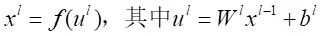
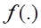
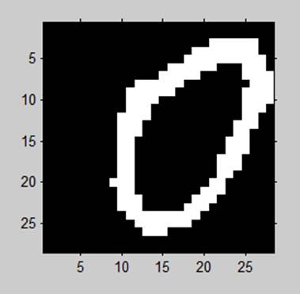
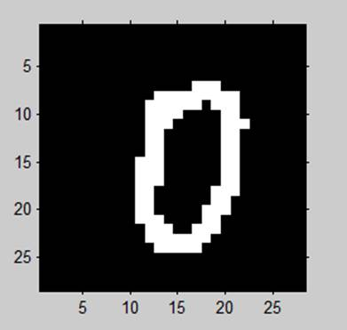

****

 本科毕业设计（论文）

 

 

 

**基于卷积神经网络的手写数字及写字人识别**

（题目：二号，黑体，加粗，居中）

​                      

 

 

 

| **学院**     |      |
| ------------ | ---- |
| **专业**     |      |
| **学生姓名** |      |
| **学生学号** |      |
| **指导教师** |      |
| **提交日期** |      |

 

印刷封面纸用210g的橙色卡纸

华南理工大学

学位论文原创性声明

（标题：二号，黑体，居中，单倍行距，段前、段后各0.5行）

（正文四号，宋体，1.5倍行距，段首行空两个汉字）

本人郑重声明：所呈交的论文是本人在导师的指导下独立进行研究所取得的研究成果。除了文中特别加以标注引用的内容外，本论文不包含任何其他个人或集体已经发表或撰写的成果作品。对本文的研究做出重要贡献的个人和集体，均已在文中以明确方式标明。本人完全意识到本声明的法律后果由本人承担。

作者签名：            日期：  年  月  日

 

学位论文版权使用授权书

本学位论文作者完全了解学校有关保留、使用学位论文的规定，即：学校有权保存并向国家有关部门或机构送交论文的复印件和电子版，允许学位论文被查阅；学校可以公布学位论文的全部或部分内容，可以允许采用影印、缩印或其它复制手段保存、汇编学位论文。本人电子文档的内容和纸质论文的内容相一致。

作者签名：            日期：   年  月  日

指导教师签名：          日期：   年  月  日

 

# 摘 要

（标题：小二号，黑体，居中，单倍行距，段前、段后各0.5行，两字中间空2字符）

（摘要正文共400—600个字；小四号，宋体，1.5倍行距，段首行空两个汉字）

炔烃和叠氮化合物的点击化学反应，有着快速、百分百原子利用率、产物高选择性等众多优点，被誉为点击化学中的精华。基于此反应拓展而来的点击聚合反应，迅速在高分子材料领域获得了了广泛关注和应用。

……

我们还尝试了采用不同单体，在最优条件下进行反应，均获得了高分子产物。表明了该反应体系的普适性。

（此处隔一行）

关键词：多变量系统；预测控制；环境试验设备

（“关键词”：小四号，黑体；关键词3—5个：小四号，宋体；关键词之间用分号隔开；最后一个关键词不打标点符号）

（另起页：外文摘要范例；英文摘要和关键词应该是中文摘要和关键词的翻译）

# Abstract

（标题：小二号，Times New Roman字体，居中，单倍行距，段前、段后各0.5行）

（正文：小四号，Times New Roman字体，1.5倍行距）

Artificial Neuron Network (ANN) simulates human being’s brain function and build the network structure. Convolutional Neural Network (CNN) have many advantage, such as ……

  This paper introduces the common pretreatment method of image, such as collecting image, normalization, graying and binarization. And apply these to the handwritten numeral recognition experiment and handwritten numerals writer recognition experiments.

 

**Keywords**: Writer recognition；Convolutional Neural Network；Handwritten character recognition

(“Keywords”：Times New Roman字体，小四号，加粗，居左）（关键词：Times New Roman字体，小四号）
 （另起页：目录范例）

# 目 录

（标题：小二号，黑体，居中，两字之间空2字符，目录为电脑自动生成）

（各章标题、结论、参考文献、致谢：黑体，四号；其余：宋体，小四号，行距1.5倍）

[摘 要. I](#_Toc134255663)

[Abstract II](#_Toc134255664)

[目 录. III](#_Toc134255665)

[第一章............................... 绪论. 1](#_Toc134255666)

[1.1............................................ 引言. 1](#_Toc134255667)

[1.2........................................ 研究背景. 1](#_Toc134255668)

[1.3........................................ 研究现状. 1](#_Toc134255669)

[1.4........................................ 论文结构. 2](#_Toc134255670)

[第二章............. 卷积神经网络的基础知识. 3](#_Toc134255671)

[2.1......................... 卷积神经网络的网络结构. 3](#_Toc134255672)

[2.1.1 输入层. 3](#_Toc134255673)

[2.1.2 输出. 3](#_Toc134255674)

[2.2......................... 卷积神经网络的学习规律. 3](#_Toc134255675)

[2.2.1 前向传播. 3](#_Toc134255676)

[2.2.2 反向传播. 4](#_Toc134255677)

[2.2.3 学习特征图的组合. 4](#_Toc134255678)

[2.3........................................ 本章小结. 4](#_Toc134255679)

[第三章. 基于卷积神经的手写数字及写字人识别算法设计. 5](#_Toc134255680)

[3.1............................... 输入输出层的设计. 5](#_Toc134255681)

[3.2.................................... 隐藏层的设计. 5](#_Toc134255682)

[3.3........................................ 本章小结. 5](#_Toc134255683)

[第四章. 手写数字及写字人识别实验过程及其结果 6](#_Toc134255684)

[4.1............................... 手写数字识别实验. 6](#_Toc134255685)

[4.1.1 样本简介. 6](#_Toc134255686)

[4.1.2 Writer Depend类数字识别实验. 6](#_Toc134255687)

[4.1.3 Writer Depend类数字识别实验结果分析. 7](#_Toc134255688)

[4.1.4 Writer Independ类数字识别实验. 8](#_Toc134255689)

[4.1.5 样本简介. 8](#_Toc134255690)

[4.1.6 两位写字人识别实验. 8](#_Toc134255691)

[4.2........................................ 本章小结. 9](#_Toc134255692)

[结论. 10](#_Toc134255693)

[1...................................... 论文工作总结. 10](#_Toc134255694)

[2.......................................... 工作展望. 10](#_Toc134255695)

[参考文献. 11](#_Toc134255696)

[致谢. 13](#_Toc134255697)

# 第一章   绪论

（各章标题：黑体，小二号，居中，单倍行距，段前、段后各0.5行；章节序号与标题之间空一字符）

## 1.1     引言

（各节一级标题：黑体，小三号，居左，单倍行距，段前、段后各0.5行）

  （正文：1.5倍行距；中文：宋体，小四号，每段首行空2个汉字；字母和阿拉伯数字：Times New Roman字体，小四号）

  当今社会，科技的飞速发展为大家提供了快捷与舒适，但与此同时也增添了在信息安全上的危险。在过去的二十几年来，我们通过数字密码来鉴别身份，但是随着科技的发展，不法分子借用高科技犯罪的案例年年增高，密码被盗的情况时常发生。因此，怎样科学准确的辨别每一个人的身份则成为当今社会的重要问题。

## 1.2     研究背景

  随着科技的日益发展，传统的密码因为记忆的繁琐以及容易被盗，似乎已经不再能满足这个通信发达的社会的需求。人们急需一种更便捷而且辨识度更高的方式来辨识身份。循着便捷与辨识度高这两个约束条件[1]（正文中引用文献序号用小4号Times New Roman体、以上角标形式置于方括号中），我们联想到的便是存在于每个人身上的生物特征，所以基于每个人身上不同的生物特征而研究的鉴别技术现在成为了身份辨别技术上的主流。

## 1.3     研究现状

  笔迹获取的方式有两种，所以鉴别方式也分为离线鉴别和在线鉴别[2,3] （此处引用连续多篇文献，序号用逗号隔开）。在线鉴别是采用专用的数字板来实时收集书写信号。由文献[4-7] （此处参考文献为文中直接说明，其序号应该与正文排齐）可知，因为信号是实时采集的，所以能采集的数据不仅包括笔迹序列，而且可以采集到书写时的加速度、压力、速度等丰富有用的动态信息。

## 1.4     论文结构

本文分为四章。其中第一章简述了笔迹识别的研究背景和意义以及笔迹识别的基础知识等。第二章节从卷积神经网络的发展历史、网络结构、学习规律三方面详细的讲述了卷积网络的基础知识。第三章针对本文中的手写数字及写字人实验具体设计卷积神经网络的网络结构以及训练过程。第五章节是手写数字识别及写字人识别实验的结果与分析。

# 第二章   卷积神经网络的基础知识

（各章标题：黑体，小二号，居中，单倍行距，段前、段后各0.5行；章节序号与标题之间空一字符）

## 2.1     卷积神经网络的网络结构

（各节一级标题：黑体，小三号，居左，单倍行距，段前、段后各0.5行）

（正文：1.5倍行距；中文：宋体，小四号，每段首行空2个汉字；字母和阿拉伯数字：Times New Roman字体，小四号）

卷积神经网络作为深度学习的一个分支，在网络结构上同样含有深度学习的“深度”性。网络拓扑结构是一个多层的神经网络[8]，网络的每一层由多个独立的神经元组成的二维平面组成。网络一般分为输入层、卷积层、池化层、全连接层、输出层等。

### 2.1.1  输入层

（各节二级标题：黑体，四号，居左，单倍行距，段前、段后各0.5行）

因为卷积神经网络可以直接的接受二维的视觉模式[9]，所以我们可以直接把简单预处理后的二维图像输入到输入层中。

### 2.1.2  输出

  ……

## 2.2     卷积神经网络的学习规律

……

### 2.2.1  前向传播

  如果用l来表示当前的网络层，那么当前网络层的输出如公式（2-1）所示：

​              （2-1）

（公式：公式一般居中书写；序号按章编排，如本公式为第二章第一个公式，则序号为（2-1））

  其中为网络的输出激活函数。在本文实验中，网络的输出激活函数选用sigmoid函数，因此网络的输出均值一般来说趋于0。

### 2.2.2  反向传播

……

### 2.2.3  学习特征图的组合

……

## 2.3     本章小结

……

# 第三章   基于卷积神经的手写数字及写字人识别算法设计

## 3.1     输入输出层的设计

  ……

## 3.2     隐藏层的设计

 ……

## 3.3     本章小结

 ……

# 第四章   手写数字及写字人识别实验过程及其结果

（各章标题：黑体，小二号，居中，单倍行距，段前、段后各0.5行；章节序号与标题之间空一字符）

## 4.1     手写数字识别实验

（各节一级标题：黑体，小三号，居左，单倍行距，段前、段后各0.5行）

### 4.1.1  样本简介

（各节二级标题：黑体，四号，居左，单倍行距，段前、段后各0.5行）

（正文：1.5倍行距；中文：宋体，小四号，每段首行空2个汉字；字母和阿拉伯数字：Times New Roman字体，小四号）

本论文的手写数字识别实验当中所用的样本分为两类，一类是训练样本集，另一类是测试样本集。

  实验当中的训练样本集采用的是手写数字MNIST数据库。这个数据库当中包含训练集样本60000个样例和测试集样本10000个样例。MNIST数据库当中的数字样本已经全部大小归一化灰度化并且集中到同一个固定大小的图像当中。该数据库包括MST的SD-1和SD-3数据库，当中包含一系列的二级制的手写数字图像。其中SD-1的收集者来源是某高中的在校学生，而SD-3是由人口调查局员工收集的。则我们的训练样本集也就是MNIST当中的训练样本集有30000个样本来自SD-3，而另外30000个样本来自SD-1。这60000个训练样本分别来自约250个采集者。

### 4.1.2  Writer Depend类数字识别实验

#### 4.1.2.1      ABCvsA数字识别实验

（各节三级标题：黑体，小四号，居左，单倍行距，段前、段后各0.5行）

实验内容：以A写字人、B写字人和C写字人，合计3000个数字0到9的数字图像数据为训练样本集。A写字人的1000个数字0到9的数字图像数据为测试样本集。学习率为1，单次训练样本数为10个，共训练40次。若识别所得数字与给定的标签匹配，则视为正确；不匹配则视为错误。

表4-1 ABCvsA数字识别实验结果

（表的标题：位于表的上方，一般居中，宋体，五号；表的序号：按章编排，如此表为第四章第一个表，则序号为“表4-1”，序号与文字描述之间空一格）

（表格不加左、右列线；表内数字空缺的格内加“—”字线）

（表中文字：宋体，五号）

| 训练样本 | ABC  | 样本个数       | 3000   |
| -------- | ---- | -------------- | ------ |
| 测试样本 | A    | 样本个数       | 1000   |
| 训练次数 | —    | 单次训练样本数 | 10     |
| 学习率   | 1    | 正确率         | 99.50% |

#### 4.1.2.2      ABCvsABC数字识别实验

  实验内容：以A写字人、B写字人和C写字人，合计3000个数字0到9的数字图像数据为总样本集。在总样本集当中随机抽取2400个为训练样本集，余下的600个为测试样本集。学习率为1，单次训练样本数为10个，共训练40次。若识别所得数字与给定的标签匹配，则视为正确；不匹配则视为错误。

表4-2 ABCvsABC数字识别实验结果

| 训练样本 | ABC  | 样本个数       | 2400   |
| -------- | ---- | -------------- | ------ |
| 测试样本 | ABC  | 样本个数       | 600    |
| 训练次数 | 40   | 单次训练样本数 | 10     |
| 学习率   | 1    | 正确率         | 92.00% |

### 4.1.3  Writer Depend类数字识别实验结果分析

  下面我们选取Writer Depend类数字识别实验当中的两个典型的例子ABCvsA数字识别实验以及MNIST&ABCvsA数字识别实验的结果做详细分析。我们从ABCvsA数字识别实验中的训练样本集和测试样本集的手写数字图像样本集当中分别随机抽取一幅图像如图4-1所示。

 

a)   实验训练集            b)实验测试集

图4-1 ABCvsA数字识别实验集

（图的标题：位于图的下方，一般居中，宋体，五号；图的序号：按章编排，如此表为第四章第一个图，则序号为“图4-1”，序号与文字描述之间空一格）

（图中若有分图时，分图号用a)、b)等置于分图之下）

下面我们对上述的训练集和测试集进行40次学习率为2，单次训练样本为10的迭代，得到错误率为0.50%，而其中每次训练时的误差值组成的历史误差值画图分析如下：

……

### 4.1.4  Writer Independ类数字识别实验

实验内容：以MNIST数据库为训练样本集，共计60000个训练样本。以A写字人合计1000个数字0到9的数字图像数据为测试样本集写字人识别实验

……

### 4.1.5  样本简介

  ……

### 4.1.6  两位写字人识别实验

#### 4.1.6.1      单个数字的写字人识别实验

  实验内容：以A写字人，合计800个数字5的数字图像数据加上B写字人，合计800个数字5的数字图像数据，共计1600个样本为总样本集。随机选取其中的1200个样本为训练样本集，其余的400个样本为测试样本集。学习率为2，单次训练样本数为10个，共训练30次。若识别所得写字人与给定的标签匹配，则视为正确；不匹配则视为错误。

表4-3 单个数字写字人识别实验结果

| 训练样本 | A5&B5 | 样本个数       | 1200   |
| -------- | ----- | -------------- | ------ |
| 测试样本 | A5&B5 | 样本个数       | 400    |
| 训练次数 | 30    | 单次训练样本数 | 10     |
| 学习率   | 2     | 正确率         | 99.75% |

#### 4.1.6.2      单个数字的写字人识别实验结果分析

……

## 4.2     本章小结

……。

# 结论

（总结标题：黑体，小二号，居中，单倍行距，段前、段后各0.5行）

## 1.   论文工作总结

（各节一级标题：黑体，小三号，居左，单倍行距，段前、段后各0.5行）

……

## 2.   工作展望

……

# 参考文献

（参考文献标题：黑体，小二号，居中，单倍行距，段前、段后各0.5行）

（参考文献和注释正文：小四号，宋体，1.5倍行距）                                 

[1]  LeCun Y, Bottou L, Bengio Y, et al. Gradient-based learning applied to document recognition[J]. Proc. IEEE, 1998, 86(11): 2278-2324.

期刊文献

［序号］作者．文献题名[J]．刊名,出版年份,卷号(期号)：起-止页码.

[2]  刘国钧，陈绍业，王凤翥.图书馆目录[M].北京:高等教育出版社，1957.15-18. 

学术著作

［序号］作者．书名[M].出版地:出版社, 出版年: 起-止页码  .                                                            

[3]  Ngiam J, Chen Z, Chia D, et al. Tiled convolutional neural networks[C], Advances in Neural Information Processing Systems. 2010: 1279-1287. 

有ISBN号的论文集

［序号］作者．题名[A].主编．论文集名[C]．出版地：出版社,出版年：起-止页码.      

[4]  田露. 基于多特征数据融合的离线中文笔迹鉴别研究[D]. 河南大学, 2011.

[5]  张慧档. 笔迹鉴别方法研究[D]. 郑州大学, 2002.

[6]  梁亮. 图像处理技术在笔迹鉴定系统开发过程中的应用与研究[D]. 沈阳工业大学, 2007.

[7]  陈先昌. 基于卷积神经网络的深度学习算法与应用研究[D]. 浙江工商大学, 2014.

[8]  王强. 基于CNN的字符识别方法研究[D]. 天津师范大学, 2014.

学位论文

［序号］作者．题名[D]．授予单位地：授予单位,年份.

[9]  姜锡洲.一种温热外敷药制备方案[P].中国专利:881056073，1989-07-26.

专利文献

［序号］专利所有者．专利题名[P]．专利国别：专利号,发布日期.

[10] GB/T 16159-1996，汉语拼音正词法基本规则[S].北京：国家技术监督局，1996.

技术标准

[序号] 标准代号,标准名称[S].出版地：出版者,出版年

[11] 谢希德.创造学习的新思路[N].人民日报，1998-12-25(10).

报纸文章

[序号］作者．题名[N]．报纸名,出版日期(版次)

[12] 冯西桥.核反应堆压力管道和压力容器的LBB分析[R].北京:清华大学核能技术设计研究院，1997.

报告

［序号］作者．文献题名[R]．报告地：报告会主办单位,年份

[13] 王明亮.关于中国学术期刊标准化数据库系统工程的进展[EB/OL].http://www.cajcd.edu.cn/pub/wml.txt/980810-2.html,1998-08-16/1998-10-04.

电子文献

［序号］作者．电子文献题名[文献类型/载体类型]．文献网址或出处,发表或更新日期/引用日期(任选)

[14] Krizhevsky A, Sutskever I, Hinton G E. Imagenet classification with deep convolutional neural networks[C], Advances in neural information processing systems. 2012: 1097-1105.

[15] Zeiler M D, Fergus R. Visualizing and understanding convolutional networks[M], Computer Vision–ECCV 2014. Springer International Publishing, 2014: 818-833.

[16] Zeiler M D, Krishnan D, Taylor G W, et al. Deconvolutional networks[C],Proc. CVPR, 2010: 2528-2535.

# 致谢

……