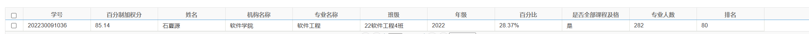

## 面试准备

着装外表准备：白衬衫、梳一下头发、相机位置要好（带着游戏本进去比较好）似乎那个地方可以提前刷卡进去然后手机申请离场但是继续蹭一会儿。

### 在校绩点以及经历

#### 成绩

排名前百分之28

#### 获奖经历

1. 2023年(第四届)“大湾区杯”粤港澳金融数学建模竞赛荣获本科组优胜奖
2. 2023-2024 年度学校二等奖学金
3. 2024年3月第十四届全国大学生“创新、创意、创业”挑战赛校赛二等奖
4. 2025年美国数学建模大赛H奖项
5. 2024年计算机大赛-AIGC创新赛中荣获应用赛道全国优胜奖
6. 2025年华南理工大学学生志愿者寒假社会实践活动中表现优异,荣获社会实践先进个人

#### 实践经历

大一就读于电子商务专业担任学习委员

大一末转专业进入软件工程专业

大二进入校内老师项目组，从数据处理起步并最终转向图形领域开发，后期参与yolo相关项目之中

### 项目经历

#### 项目一：程序化城市生成系统（算法设计核心项目）

**主导算法设计与技术选型**，实现了基于张量场与流线算法的2D风格街区自动生成系统。

- **算法创新**：实现了基于**张量场方向场与流线数值积分**的道路网络生成算法，通过参数化控制实现道路密度、地块分割、建筑布局的自动化生成，输出结构化的几何数据。
- **数学运算**：采用噪声函数生成水体与自然景观，通过**布尔运算**处理模型交汇/凹陷，构建完整的三维城市模型。
#### 项目二：YOLO目标检测模型微调（模型训练核心项目）

针对非遗文化图像识别任务，基于YOLO框架进行**自定义多类别目标检测模型的微调训练**。

- **数据工程**：组织多人完成数百张图像的标注工作，处理多角度、多光照场景下的样本不平衡问题。
- **模型调优**：加载预训练模型，通过**损失函数监控**发现漏标导致的识别不稳定，经补充数据与修正标注后，模型准确率稳定提升。
- **核心能力**：积累了**深度学习模型微调、训练调试、超参数优化**的全流程经验。
#### 毕业设计

设计并开发了**城市场景生成与可视化平台**，作为本科阶段综合实践成果。

- **核心功能**：用户通过参数面板调整布局，实时预览三维模型，支持SVG编辑与模型交互。
- **AI延伸设计**：计划集成**大模型接口**，实现自然语言→布局参数的自然交互，并探索**高效模型推理**在实时生成场景中的应用；并加入Agent智能体，为场景中加入"居民".
- **技术栈**：React + Three.js + FastAPI+SpringBoot，模块化设计，支持后续扩展。

## ai使用情况

作为架构师，提供需求和架构设计，进行细节填充，并对接到最后的测试。

使用过codex、claude等功能

### 工作适配度-组态开发工程师

#### 了解到的公司情况

#### 发展方向，可用之处

在工程实践中，锻炼自己对性能、架构方面的把握能力。

技术面试官
研发部分负责人
大方面讨论
还有部门人力校招负责人
下次整个相机上方的
面试官弄个上方的
自己的面试要充分准备，基本信息，毕业院校，成绩，重点项目经历成果，技术层面的适配度-组态开发工程师
三五分的自我介绍
仔细准备一下
项目背景以及结果
要做什么
我做什么
取得了什么结果
表述是否清晰
对ai的使用情况
后续会考察ai的相关方面
大学活动的深刻活动
自我介绍也要涉及到贵司的了解
主要是技术和人力
其它负责打分
白衬衫
头发打理一下

## 代码架构

等老师架构好，我自己页上线补充迁移功能；

先去搓一下模型，把工具弄出来，正好弄到那个客户端软件里面，给同学用就好。