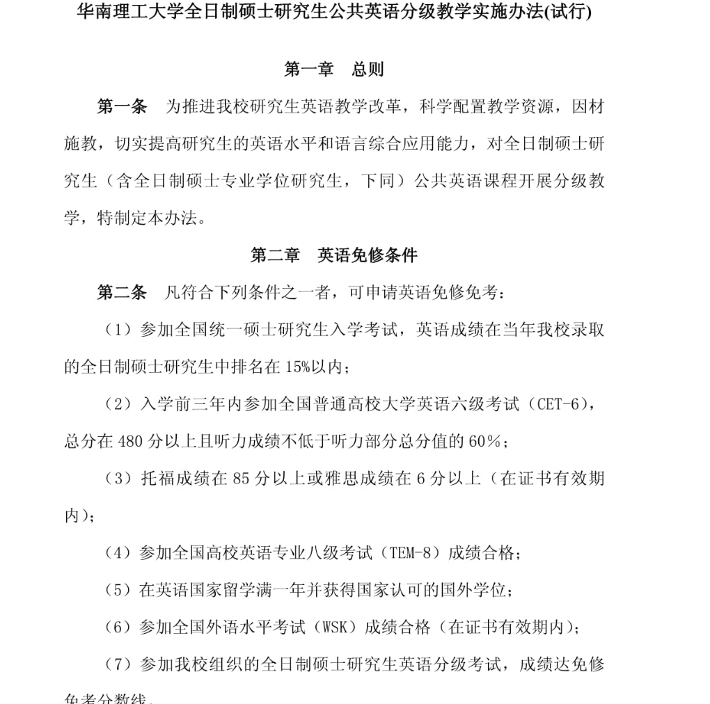

### ppt准备

放弃了，还是老老实实手搓ppt吧，学习使用slidev太麻烦了，很多格式还是不太好控制。

制作ppt看来比预计消费的时间更久一点。

明天的ppt搞定了，接下来就是准备准备代码和毕业论文，以及看看明天会议上的文章了。

### 规划

很多东西还是早作规划，不然总是准备匆匆忙忙，最直接就是购物没规划调查规划导致总是赶不上折扣价，痛失显卡300元差价，痛！

周日麦2路线调查，车票以及过去之后的消费报销；

已经可以着手从兄弟那里收揽装备了，直接抄作业。

然后进行博士阶段的规划，研究生阶段的规划，最好做出一点成果能够被c9的导师甚至院士录用为博士，硕博连读貌似不太靠谱。

得做出点申请考核制度，那就得了解目标院校的基本要求了。

本科阶段太懒了，也太不敢想了，有点低估自己的能量，其实可以试着冲一冲的，走一步看一步来调整规划。
### 研究生入学

#### 购物计划

1. 入学得准备考试，争取拿到免修免考的资格，前百分之15。
2. 采购问题，十月份直接拨款9000元，规划买点东西：
	1. 电瓶车一定有，价格在2000元左右，然后还得了解挂牌政策。
	2. 手机得换一个，如果没有新手机发布就搞一个5000的mate系列，存储一定得大！
	3. 整一个mac，主要是续航，我可以搬着到外面到处写文档，上床也可以带着，包里也不占位置，存储得1T起步，放不了游戏，或者管理资料，但是确实好贵，要直接到8000了。
	4. 鼠标、耳机、手表等外设也需要同步更新一下，切记避免任何有线设备！
3. 还有就是眼睛，近视加深，突破350度了！
4. 还得考虑一下vlog设备，暂时不知道买什么。

必需品的价格已经来到了7k+8k，呜呜呜，平板这个需求可以萎缩一下，毕竟阅读平板确实作用不大。

现在好了，电瓶车计划泡汤，没有完全合法的渠道去挂牌了。
#### 采购资金来源

1. 入学拨款，屯一手，但是不够；
2. 可能得向家里扣一部手机出来了；
3. 然后就是川西旅行，看能不能省一点
4. 然后就是注意点生活费了，生活费还久说不定可以在暑假的时候整部新的手机出来，其实最好还是mac也整出来。

### 学习习惯

1. 学习环境优先，游玩环境次之但是也不遮掩。
2. 主要还是纸质版优先，事后汇总到文档中比如md、xmind，直接上平板感觉太丑了，还老容易碰到诱惑。
3. 有电子文档就顺手打印出来即可，如果没有就自己购入一个简易版本的打印机。

