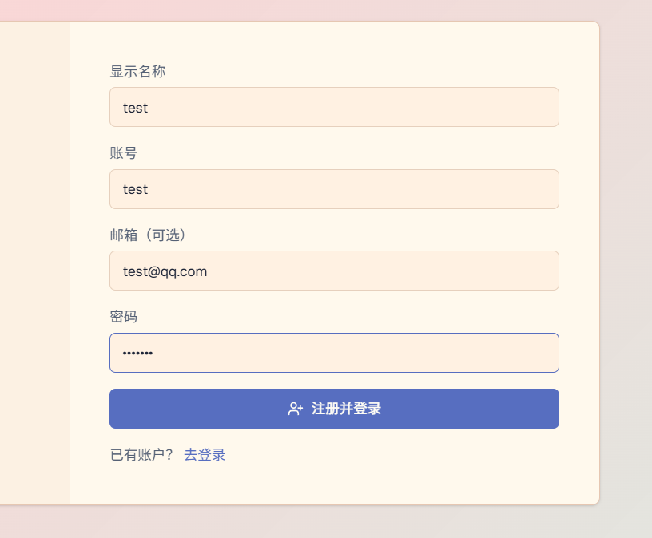

test123

自动注册并登录，应该自动开启进入单属于用户的后台管理即创作者模式比较好，现在注册并登录虽然显示账户信息在右上角，但是无法进入登录状态并开启用户自己的后台界面进行场景构建

button group替换使用

ResizablePanelGroup orientation="vertical"        ← 外层垂直
  ├── ResizablePanel (顶部栏，最小40px)
  ├── ResizableHandle withHandle
  └── ResizablePanel (底部区域)
        └── ResizablePanelGroup orientation="horizontal"  ← 内层水平
              ├── ResizablePanel (左边栏，可折叠)
              ├── ResizableHandle withHandle
              └── ResizablePanel (主内容区 → <Outlet/>)
                    └── 各功能页自己的 ResizablePanelGroup  ← 页面内水平
                          ├── ResizablePanel (主工作区，有圆角边框)
                          ├── ResizableHandle (透明，无 handle)
                          └── ResizablePanel (右边栏，无外框)

伪元素是什么？

这个思路借鉴了“骨架屏”和“渐进式渲染”的理念：将“布局列表”作为“骨架”优先、快速地展示出来，而将“模型批次数据”作为“内容”，在用户需要时或稍后异步地填充进去。

  

⚙️ 如何实现“分层加载”

方案一：按需加载

这是最直接、对现有代码改动最小的方案。

  

默认收起：布局列表项默认处于收起状态，此时只渲染布局本身的信息，DOM 结构非常轻量。

  

点击展开时才请求：用户点击“展开”按钮时，才触发对该布局下模型批次数据的 API 请求。请求期间显示加载状态，数据返回后再渲染子列表。

  

配合缓存：已经加载过的数据可以缓存在内存中（例如使用 React Query 的 staleTime），避免重复请求。这个方案会比现在的性能提升大很多吗